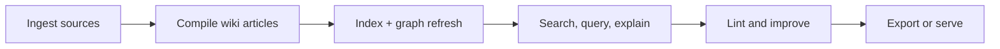

# Overview

Lore is a CLI tool that builds persistent LLM knowledge bases from any content. It ingests documents, compiles them into an interlinked markdown wiki, and provides full-text search, Q&A, and export capabilities.

## What Lore Optimizes For

- durable knowledge artifacts over transient chat context
- markdown-native outputs that are easy to review and version
- practical operations loops for ingest, compile, lint, query, and export
- agent interoperability through MCP and structured command outputs

## Key Features

- **Multi-format ingestion** -- markdown, PDF, DOCX, HTML, JSON, images, URLs, videos
- **LLM compilation** -- raw documents compiled into structured wiki articles with backlinks, hash-based incremental compile, and compile lock safety
- **FTS5/BM25 search** -- fast full-text search with ranking and snippets
- **BFS/DFS traversal** -- navigate the knowledge graph via backlinks
- **Watch automation** -- debounced raw change detection with queued auto-compile coordination
- **Health diagnostics** -- lint summary + line-aware diagnostics for broken links and weak pages
- **Concept metadata index** -- generated `.lore/wiki/concepts.json` with canonical names, aliases, tags, and confidence
- **Obsidian compatible** -- `[[wiki-links]]`, YAML frontmatter, `.canvas` files
- **MCP server** -- agent-accessible search and query
- **Multiple exports** -- bundle, slides, PDF, DOCX, web, canvas, GraphML

## Core Workflow



## Who This Is For

| Persona | Typical use |
|---|---|
| Engineering teams | Preserve architecture decisions and implementation context |
| Product/ops teams | Build searchable operational runbooks from mixed docs |
| AI-agent workflows | Provide a persistent knowledge surface for MCP tools |
| Individual researchers | Curate and query evolving topic maps |

## Use Cases

### Engineering decision memory

- ingest RFCs, PR notes, and design docs
- compile and query for historical decision rationale
- use Angela to capture why behind code changes

### Team onboarding acceleration

- compile internal docs into concept-linked pages
- run `lore explain` on unfamiliar components
- export to web/pdf for broader distribution

### Agent maintenance loop

- run MCP tools to discover gaps/orphans/ambiguity
- repair index, recompile, and re-lint
- ask targeted questions over refreshed graph state

## Quick Example

```bash
lore init
lore ingest ./docs
lore compile
lore query "How does compile lock recovery work?"
lore export web
```

## Related Docs

- [Installation](./installation.md)
- [Quickstart](./quickstart.md)
- [Architecture](../technical/architecture.md)
