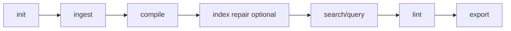

# Quickstart

This quickstart walks through the full Lore lifecycle: initialize, ingest, compile, retrieve, validate, and export.

## 1) Initialize

```bash
lore init
```

Expected result: `.lore/` is created with base config and storage layout.

## 2) Ingest content

```bash
# local file
lore ingest ./README.md

# URL
lore ingest https://example.com/article
```

Expected result: new `.lore/raw/<sha256>/` entries with `extracted.md` and `meta.json`.

## 3) Compile into wiki articles

```bash
lore compile
```

Expected result: `.lore/wiki/articles/*.md`, updated `.lore/wiki/index.md`, refreshed search/link index. Articles carry inline provenance markers tracking which sources contributed to each line.

After upgrading from an older Lore version, run `lore compile --concepts-only` to backfill provenance for existing articles.

## 4) Search and ask

```bash
# lexical discovery
lore search "concept"

# graph + LLM answer
lore query "What is the architecture?"
```

## 5) Validate graph health

```bash
lore lint --json
```

Use lint output to identify gaps, orphans, and ambiguous articles.

## 6) Export artifacts

```bash
lore export bundle
```

Default output location: `.lore/exports`.

## Optional: Continuous watch mode

```bash
# auto-compile raw changes with debounce and queueing
lore watch
```

## Optional: Repair-first indexing

```bash
# useful after partial copies/interrupted operations
lore index --repair
```

## End-to-End Script

```bash
lore init
lore ingest ./README.md
lore ingest https://example.com/article
lore compile
lore index --repair
lore lint --json
lore query "What changed in architecture?"
lore export bundle
```

## Quickstart Flow



## Next Steps

- [Compiling Your Wiki](../guides/compiling-your-wiki.md)
- [Troubleshooting](../guides/troubleshooting.md)
- [Linting and Health](../guides/linting-and-health.md)
- [Exporting](../guides/exporting.md)
- [CLI Reference](../reference/cli-reference.md)
