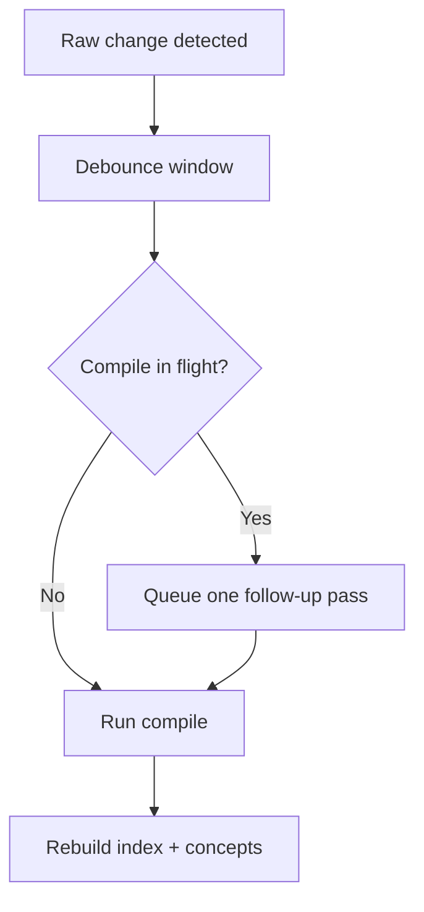

# Compiling Your Wiki

```bash
lore compile [--force]
```

Compilation uses an LLM to transform raw extracted documents into structured wiki articles with `[[backlinks]]`, YAML frontmatter, and confidence labels.

During indexing, Lore applies a lightweight disambiguation guardrail to ignore low-signal wiki-link targets (for example `[[it]]` or `[[the]]`) so noisy generic terms do not pollute the graph.

## Hash-Based Incremental Compile

Lore now tracks an `extractedHash` per raw entry in `.lore/manifest.json`.

- Default behavior: compile only entries whose extracted content changed.
- First run after upgrade: previously compiled entries without `extractedHash` are recompiled once, then upgraded.
- `--force`: bypass hash checks and recompile all valid raw entries.

This keeps repeated compile runs fast and reduces unnecessary token usage.

## Batch Retry Behavior

Compile processes sources in batches (default size 20). If a batch response is retryable (for example truncated model output or invalid article payload), Lore halves the batch size and retries.

| Condition | Behavior |
|---|---|
| LLM response truncated | Retry with smaller batch |
| No parsable articles returned | Retry with smaller batch |
| Unterminated frontmatter / missing title | Retry with smaller batch |
| Batch size reaches 1 and still fails | Compile exits with error |

This strategy protects long runs from failing due to a single oversized batch.

## Compile Lock and Concurrency

Lore guards compile with `.lore/compile.lock` to prevent overlapping runs.

- If another live compile is active, `lore compile` fails fast with an actionable error.
- Stale or malformed lock payloads are reclaimed automatically.
- `lore watch` integrates with this behavior and reports busy/queued status during auto-compile loops.

The lock file stores a process ID (PID). If that PID is no longer alive, Lore removes the stale lock and retries acquisition.

## Index Rebuild and Repair

After compile, keep search and graph state fresh:

```bash
lore index
```

If raw entries exist but `manifest.json` drifted (for example after partial copy or interrupted runs):

```bash
lore index --repair
```

`--repair` reconstructs missing manifest entries from `.lore/raw/` before index rebuild.

Repair only restores missing manifest keys. It does not regenerate broken raw files.

## Confidence Labels

- `extracted` -- directly stated in source documents
- `inferred` -- reasonable LLM deduction
- `ambiguous` -- uncertain, flagged for human review

## Concept Metadata Output

After successful compile and index rebuild, Lore writes:

- `.lore/wiki/concepts.json`

The file contains:

- `updatedAt`
- `concepts[]` entries with:
	- `slug`
	- `canonical`
	- `title`
	- `aliases`
	- `tags`
	- `confidence`

Alias generation is deterministic and includes slug aliases, conjunction-swap variants (`A and B` -> `B and A`), and acronyms for 3+ word titles.

## Graph Guardrails

During index rebuild, Lore filters low-signal link targets (for example `[[it]]`, `[[the]]`) to avoid noisy graph edges.

- Benefit: better `lore path`, cleaner neighbor sets, higher-signal lint output.
- Tradeoff: intentionally generic links are dropped unless they map to meaningful concept tokens.

## Suggested Compile Workflow

```bash
# ingest and compile
lore ingest ./docs
lore compile

# refresh index and graph
lore index --repair

# inspect graph health
lore lint
```

## Watch Mode Interaction

`lore watch` can auto-compile raw changes with debounce and queueing.

- Debounce: raw changes are grouped (default 1 second)
- If compile is already running, one follow-up pass is queued
- Wiki article edits trigger reindex directly (without full compile)



## Troubleshooting Compile Runs

| Symptom | Likely cause | Fix |
|---|---|---|
| Frequent retries with shrinking batch size | Content volume too large for one request | Re-run compile and let auto-reduction complete |
| Lock errors in automation | Another compile process active | Serialize compile jobs and retry later |
| No new articles written | Incremental hash skipping unchanged entries | Use `lore compile --force` |
| Index appears out of date after failures | Compile interrupted before index rebuild | Run `lore index --repair` manually |

## Related Docs

- [Quickstart](../getting-started/quickstart.md)
- [Linting and Health](./linting-and-health.md)
- [Troubleshooting](./troubleshooting.md)
- [CLI Reference](../reference/cli-reference.md)
- [Architecture](../technical/architecture.md)
