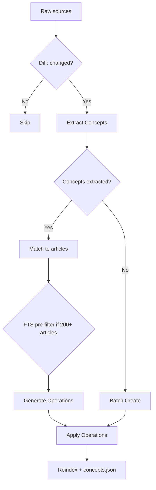
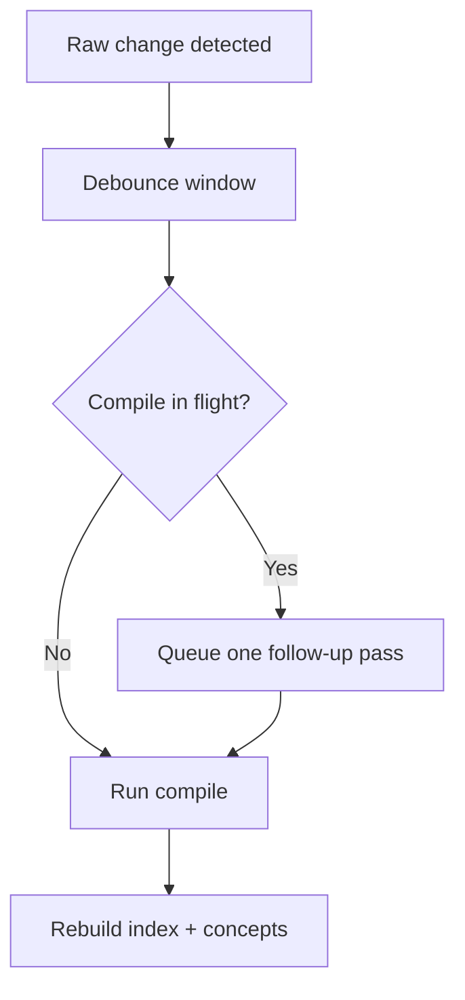

# Compiling Your Wiki

```bash
lore compile [--force] [--concepts-only]
```

Compilation transforms raw extracted documents into structured wiki articles with `[[wiki-links]]`, YAML frontmatter, confidence labels, and paragraph-level provenance tracking.

## Compile Pipeline (6 Steps)

Each `lore compile` run executes a six-step pipeline:

1. **Diff** — Compare `extractedHash` in `manifest.json` against raw content. Only changed sources proceed. `--force` bypasses this check.
2. **Extract Concepts** — The LLM extracts named concepts with descriptions and confidence from each changed source.
3. **Match** — Each source's concepts are matched against existing wiki articles. Sources with no concepts skip to batch create. For wikis with 200+ articles, FTS pre-filters the candidate list.
4. **Generate Operations** — Per matched source, the LLM outputs a list of line-level operations describing how to edit the matched articles.
5. **Apply Operations** — Operations are applied to disk: articles are modified in-place, new articles are created, deprecated articles are soft-deleted to `.lore/wiki/deprecated/`.
6. **Reindex** — The FTS index, backlink graph, and `concepts.json` are rebuilt to reflect the updated article set.



## Provenance Tracking

Lore tracks which sources contributed to every line of every article. Two mechanisms work together:

### Inline Provenance

Each line may carry an inline HTML comment recording source hashes and confidence:

```markdown
The authentication service uses JWT tokens. <!-- sources:abc123(extracted) def456(inferred) -->
```

The format is `<!-- sources:HASH(CONFIDENCE) ... -->`. Confidence labels are per-operation:

| Label | Meaning |
|---|---|
| `extracted` | Directly stated in source documents |
| `inferred` | Reasonable LLM deduction |

When the LLM reads article content for matching and operation generation, inline provenance comments are stripped. The LLM sees clean, numbered lines without source annotations.

### Cumulative References

Every article carries a `## References` section at the bottom, listing all source hashes ever merged into that article:

```markdown
## References
- abc123 (extracted)
- def456 (inferred)
- ghi789 (extracted)
```

This section is managed automatically by the system. When the LLM generates operations, `## References` and `## Related` sections are hidden from its context window.

### Related Section

The system auto-generates a `## Related` section from `[[wiki-links]]` found in the article body. Links are deduplicated and sorted.

## Operation Model

The LLM outputs a JSON array of line-level operations. Each operation targets specific lines in matched articles and includes a `sources` field for provenance tracking.

| Operation | Description |
|---|---|
| `replace` | Replace a single line's content |
| `insert-after` | Insert a new line after a target line |
| `delete-range` | Remove a range of lines (start to end, inclusive) |
| `replace-range` | Replace a range of lines with new content |
| `split` | Split an article into two: keep part at current slug, move remainder to a new slug |
| `append-source` | Add a source hash to existing lines without changing content (confidence-only update) |
| `soft-delete` | Mark an article as deprecated (renamed from its slug) |

### Operation Format

```json
[
  {
    "op": "replace",
    "line": "¶2",
    "content": "Updated content for line 2.",
    "sources": ["abc123(extracted)"],
    "confidence": "extracted"
  },
  {
    "op": "insert-after",
    "line": "¶3",
    "content": "New insight from source.",
    "sources": ["abc123(extracted)"],
    "confidence": "extracted"
  },
  {
    "op": "delete-range",
    "start": "¶5",
    "end": "¶7"
  }
]
```

Line references use the `¶` (pilcrow) symbol to distinguish from YAML frontmatter line numbers. The LLM sees articles with pilcrow-prefixed line numbers in context.

### Multi-Article Editing

A single source can generate operations targeting multiple existing articles. The system applies operations sequentially per source, refreshing the article list after each source's edits to handle splits and new articles.

### Soft Delete

When an article is no longer relevant, the LLM outputs a `soft-delete` operation. The article is renamed to a `.deprecated-{slug}-{timestamp}.md` path under `.lore/wiki/deprecated/`. It disappears from search and the link graph but the file is preserved for audit.

## Hash-Based Incremental Compile

Lore tracks an `extractedHash` per raw entry in `.lore/manifest.json`.

- Default behavior: compile only entries whose extracted content changed.
- First run after upgrade: previously compiled entries without `extractedHash` are recompiled once, then upgraded.
- `--force`: bypass hash checks and recompile all valid raw entries.

## Concepts-Only Mode

```bash
lore compile --concepts-only
```

Backfills provenance for articles that were compiled before provenance tracking was introduced. It:

1. Reads every article under `.lore/wiki/articles/`.
2. For articles without inline `<!-- sources:` comments, applies backfill logic (entire body marked with generic source hashes).
3. Rebuilds `concepts.json` and the search index.

Use this once after upgrading from a pre-provenance version of Lore. It does not recompile or change article content beyond adding provenance markers.

## Batch Retry Behavior

Compile processes sources sequentially (matching) and in batches (creating). If a response is retryable (truncated output, invalid JSON, unparseable operations), Lore retries once.

| Condition | Behavior |
|---|---|
| LLM response truncated | Retry once |
| Invalid JSON operation output | Retry once |
| Retry still fails | Skip the source, log error, continue compile |

The compile does not abort on individual source failures. Invalid operations are logged and the affected source is skipped.

## Compile Lock and Concurrency

Lore guards compile with `.lore/compile.lock` to prevent overlapping runs.

- If another live compile is active, `lore compile` fails fast with an actionable error.
- Stale or malformed lock payloads are reclaimed automatically.
- `lore watch` integrates with this behavior and reports busy/queued status during auto-compile loops.

The lock file stores a process ID (PID). If that PID is no longer alive, Lore removes the stale lock and retries acquisition.

## Index Rebuild and Repair

After compile, keep search and graph state fresh:

```bash
lore index
```

If raw entries exist but `manifest.json` drifted (for example after partial copy or interrupted runs):

```bash
lore index --repair
```

`--repair` reconstructs missing manifest entries from `.lore/raw/` before index rebuild.

## Concept Metadata Output

After successful compile and index rebuild, Lore writes `.lore/wiki/concepts.json`:

- `updatedAt` — timestamp
- `concepts[]` entries with `slug`, `canonical`, `title`, `aliases`, `tags`, `confidence`

Alias generation is deterministic and includes slug aliases, conjunction-swap variants (`A and B` → `B and A`), and acronyms for 3+ word titles.

## Graph Guardrails

During index rebuild, Lore filters low-signal link targets (for example `[[it]]`, `[[the]]`) to avoid noisy graph edges.

- Benefit: better `lore path`, cleaner neighbor sets, higher-signal lint output.
- Tradeoff: intentionally generic links are dropped unless they map to meaningful concept tokens.

## Suggested Compile Workflow

```bash
# ingest and compile
lore ingest ./docs
lore compile

# refresh index and graph
lore index --repair

# inspect graph health
lore lint
```

After upgrading from an older version:

```bash
# backfill provenance for existing articles
lore compile --concepts-only
```

## Watch Mode Interaction

`lore watch` can auto-compile raw changes with debounce and queueing.

- Debounce: raw changes are grouped (default 1 second)
- If compile is already running, one follow-up pass is queued
- Wiki article edits trigger reindex directly (without full compile)



## Troubleshooting Compile Runs

| Symptom | Likely cause | Fix |
|---|---|---|
| Frequent retries | Malformed LLM output or oversized context | Allow retry to complete; tune model/maxTokens if persistent |
| Lock errors in automation | Another compile process active | Serialize compile jobs and retry later |
| No new articles written | Incremental hash skipping unchanged entries | Use `lore compile --force` |
| Index appears out of date after failures | Compile interrupted before index rebuild | Run `lore index --repair` manually |
| Sources skipped with zero concepts | LLM could not extract concepts from content | Content may need manual review; re-ingest with better metadata |
| Old articles lack provenance | Articles compiled before provenance was introduced | Run `lore compile --concepts-only` |

## Related Docs

- [Quickstart](../getting-started/quickstart.md)
- [Linting and Health](./linting-and-health.md)
- [Troubleshooting](./troubleshooting.md)
- [CLI Reference](../reference/cli-reference.md)
- [Architecture](../technical/architecture.md)
- [LLM Pipeline](../technical/llm-pipeline.md)
