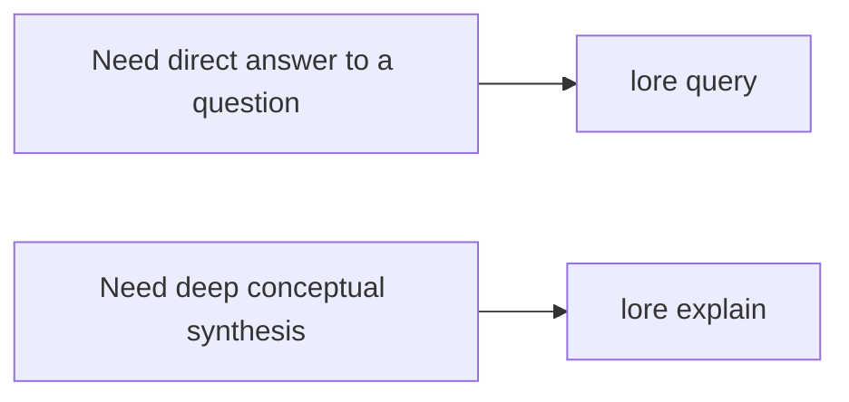

# Explain Command

```bash
lore explain "<concept>" [--json]
```

`lore explain` provides a deep concept walkthrough by combining the main matched article with nearby graph neighbors.

## Query vs Explain



| Command | Best for | Output shape |
|---|---|---|
| `lore query` | Direct question answering | Answer text plus source slugs |
| `lore explain` | Concept deep dives | Long-form explanation plus related source slugs |

## How Explain Selects Context

1. Tries an exact slug match for the concept
2. Falls back to FTS match if exact slug is missing
3. Loads neighbor articles from graph links
4. Synthesizes a detailed explanation from combined context

## Examples

```bash
# human-readable deep dive
lore explain "Compile Lock"

# script-friendly
lore explain "MCP Server" --json
```

Example JSON response:

```json
{
  "explanation": "...long-form explanation...",
  "sources": ["compile-lock", "watch-mode", "index-repair"]
}
```

## Integration Use Cases

- Onboarding deep dives for new engineers
- Architecture review prep before design meetings
- Agent workflows that need broad conceptual context rather than one-off answers

## Troubleshooting

| Symptom | Likely cause | Fix |
|---|---|---|
| `No article found for <concept>` | Concept is not indexed yet | Run `lore compile`, then retry with precise concept name |
| Explanation is too shallow | Neighbor context is sparse | Improve wiki links and rerun compile/index |
| Sources look unrelated | FTS fallback matched broad term | Use a more specific concept name |

## Related Docs

- [Searching and Querying](./searching-and-querying.md)
- [Compiling Your Wiki](./compiling-your-wiki.md)
- [Troubleshooting](./troubleshooting.md)
- [CLI Reference](../reference/cli-reference.md)
