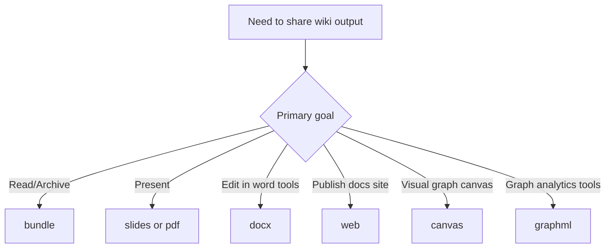

# Exporting

```bash
lore export <format> [--out <dir>] [--json]
```

Use exports when you need to share or analyze your wiki outside Lore.

- Default output directory: `.lore/exports`
- Custom output directory: `--out <dir>`
- Machine-readable result: `--json` returns `format`, `outputPath`, and `bytesWritten`

## Export Decision Flow



## Formats

| Format | Output | Best for | Notes |
|---|---|
| `bundle` | `bundle.md` | Archival, offline reading, quick sharing | Concatenates index + all article markdown |
| `slides` | `slides.md` | Presentations with Marp | Splits content into sections and slide breaks |
| `pdf` | `wiki.pdf` | Stakeholder review and snapshots | Uses a basic HTML renderer via Puppeteer |
| `docx` | `wiki.docx` | Editing in Word-like tools | Converts markdown headings/lists/paragraphs |
| `web` | `web/` project | Publishing a browsable wiki site | Scaffolds Astro + Starlight project |
| `canvas` | `wiki.canvas` | Node-link visualization workflows | JSON Canvas 1.0 with grid layout nodes |
| `graphml` | `wiki.graphml` | Gephi/yEd and graph analytics | Directed graph from wiki backlinks |

## Common Usage

```bash
# default output: .lore/exports
lore export bundle

# custom output directory
lore export web --out ./artifacts/wiki-web

# script-friendly response
lore export graphml --json
```

Example JSON response:

```json
{
	"format": "graphml",
	"outputPath": "/repo/.lore/exports/wiki.graphml",
	"bytesWritten": 84211
}
```

## Format Walkthroughs

### `bundle`

```bash
lore export bundle
```

Creates one markdown document containing your index followed by all articles separated with `---` breaks.

Use cases:

- Single-file review in editors
- Long-form archive snapshots
- Input to external markdown pipelines

### `slides`

```bash
lore export slides --out ./presentation
```

Generates Marp-compatible markdown with frontmatter and pagination enabled.

Use cases:

- Internal architecture briefings
- Knowledge transfer sessions
- Release demo decks

### `pdf`

```bash
lore export pdf
```

Builds a PDF by converting the markdown bundle through a lightweight HTML template and rendering with Puppeteer.

Use cases:

- Printable documents
- Static handoff artifacts
- Compliance snapshots

### `docx`

```bash
lore export docx
```

Converts wiki articles into a DOCX file with mapped headings and bullet lists.

Use cases:

- Collaborative editing in Office suites
- Formal review workflows
- Editorial cleanup passes

### `web`

```bash
lore export web
cd .lore/exports/web
npm install
npm run dev
```

Scaffolds an Astro Starlight site and copies your wiki pages into `src/content/docs`.

Use cases:

- Internal docs hosting
- Temporary preview sites
- Team onboarding portals

### `canvas`

```bash
lore export canvas
```

Generates JSON Canvas output with article nodes and backlink edges.

Use cases:

- Visual map of concept relationships
- Planning sessions in canvas tools
- Graph-oriented content audits

### `graphml`

```bash
lore export graphml
```

Exports a GraphML graph from your article/link tables for tools such as Gephi and yEd.

Use cases:

- Centrality/community analysis
- Graph debugging
- External data science workflows

## End-to-End Example

```bash
# 1) refresh wiki state
lore ingest ./docs
lore compile

# 2) produce multiple deliverables
lore export bundle --out ./dist/lore
lore export pdf --out ./dist/lore
lore export web --out ./dist/lore

# 3) inspect generated artifacts
ls -la ./dist/lore
```

## Troubleshooting

| Symptom | Likely cause | Fix |
|---|---|---|
| Export fails with missing article directory | Wiki has not been compiled yet | Run `lore compile` first |
| `pdf` export fails | Browser dependency issue with Puppeteer | Reinstall dependencies and retry `lore export pdf` |
| `web` export created project but site fails to start | Dependencies not installed in exported project | Run `npm install` inside the exported `web` folder |
| Output too large for sharing | Full wiki is large | Use `bundle` for text-only or segment content before export |

## Related Docs

- [Compiling Your Wiki](./compiling-your-wiki.md)
- [Searching and Querying](./searching-and-querying.md)
- [CLI Reference](../reference/cli-reference.md)
