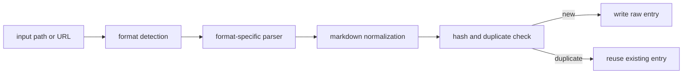

# Ingesting Content

```bash
lore ingest <path|url>
```

```bash
lore ingest-sessions [framework|all]
```

## Supported Formats

| Format | Method |
|---|---|
| `.md`, `.txt` | Direct |
| `.html` | rehype-parse |
| `.json`, `.jsonl` | JSON parser (auto-normalizes supported chat exports) |
| `.pdf`, `.docx`, `.pptx`, `.xlsx`, `.epub` | Replicate marker |
| Images (`.png`, `.jpg`, `.jpeg`, `.webp`, `.gif`, `.bmp`) | Replicate vision |
| URLs (web pages) | Cloudflare BR `/markdown` endpoint or Jina r.jina.ai |
| URLs (documents: `.pdf`, `.docx`, `.pptx`, `.xlsx`, `.epub`) | Temp download → Replicate Marker |
| URLs (images: `.png`, `.jpg`, `.jpeg`, `.webp`, `.gif`, `.bmp`) | Temp download → Replicate Vision |
| Video URLs | yt-dlp subtitles |

All ingested content is stored in `.lore/raw/<sha256>/` with `extracted.md` and `meta.json`.

## Framework Session Ingestion

Use `lore ingest-sessions` to pull session history from local framework storage.

Supported framework values:

- `claude-code`
- `codex-cli`
- `copilot-cli`
- `copilot-chat`
- `cursor`
- `gemini-cli`
- `obsidian`
- `all` (default)

Examples:

```bash
# ingest all supported framework session stores
lore ingest-sessions all

# ingest only Claude Code sessions
lore ingest-sessions claude-code

# run discovery only, no ingest writes
lore ingest-sessions all --dry-run --json

# override default roots and cap scan size
lore ingest-sessions copilot-chat --root ~/Library/Application\ Support/Code/User/workspaceStorage --max-files 200
```

Flags:

- `--root <path...>`: optional root path(s) to scan instead of defaults
- `--max-files <n>`: max discovered files per framework (default `500`)
- `--dry-run`: discover only, do not ingest
- `--json`: machine-readable summary with `runId`/`logPath`

## Ingest Flow



## Raw Entry Structure

Each raw entry is stored under:

```text
.lore/raw/<sha256>/
	extracted.md
	meta.json
	original.<ext> (or original.txt for URLs)
```

Example `meta.json`:

```json
{
	"sha256": "<sha256>",
	"format": "json",
	"title": "Conversation Transcript",
	"sourcePath": "/abs/path/to/file.json",
	"date": "2026-04-09T00:00:00.000Z",
	"tags": ["docs", "frontend", "decision"]
}
```

## Folder-Based Topical Tags

For local file ingest, Lore infers a small set of topic tags from directory names and writes them to `meta.json.tags`.

- Example mapped categories include `frontend`, `backend`, `docs`, `testing`, `tooling`, `infra`, `data`, `mobile`, and `design`.
- URL ingest does not infer folder tags and keeps `tags: []`.
- Tags are intentionally bounded and deduplicated so metadata stays concise.

Lore also applies lightweight content heuristics during ingest and can append semantic tags such as `decision`, `preference`, `problem`, `milestone`, and `emotional` when matching phrases are detected.

## Duplicate-Aware Ingest

Lore computes a SHA-256 digest from original input and reuses existing raw entries when the digest already exists.

- Duplicate hit behavior:
	- parse/extract is skipped
	- existing metadata is reused
	- manifest mtime is refreshed
- JSON output includes `duplicate: true` on duplicate hits.

Example:

```bash
lore ingest ./docs/architecture.md --json
```

Possible output fields:

```json
{
	"sha256": "...",
	"format": "md",
	"title": "Architecture",
	"duplicate": true
}
```

## How Conversation Export Ingestion Works (`.json` / `.jsonl`)

1. Lore first attempts to detect known conversation schemas.
2. When a supported schema is detected, Lore rewrites the content into transcript markdown:
	- user turns are prefixed with `>`
	- assistant turns are preserved as response blocks
3. Current auto-detection targets common exports such as role/content arrays, ChatGPT mapping exports, and Codex/Claude-style JSONL logs.
4. If no known schema is detected, Lore falls back to generic JSON-to-markdown conversion.

Supported conversation schema families include:

- role/content arrays (`[{"role":"user"...}]`)
- ChatGPT mapping exports
- Claude/Codex JSONL session logs
- Slack-style message arrays

## How PDF Ingestion Works

1. Lore detects a document extension such as `.pdf` or `.docx`.
2. The file is sent to Replicate Marker (`cuuupid/marker`) for markdown extraction.
3. The normalized markdown is written to `.lore/raw/<sha256>/extracted.md`.
4. Metadata and source tracking are written to `.lore/raw/<sha256>/meta.json`.

## How Web Document and Image URL Ingestion Works

Lore detects the file extension in the URL path to distinguish between web pages, documents, and images.

For **document URLs** (ending in `.pdf`, `.docx`, `.pptx`, `.xlsx`, `.epub`):

1. Lore downloads the file to a temporary directory.
2. Sends it through Replicate Marker — the same parser used for local documents.
3. Cleans up the temp file once extraction completes.
4. Stores result in the same raw pipeline (`extracted.md` + `meta.json`).

For **image URLs** (ending in `.png`, `.jpg`, `.jpeg`, `.webp`, `.gif`, `.bmp`):

1. Lore downloads the image to a temporary directory.
2. Sends it through Replicate Vision — the same parser used for local images.
3. Cleans up the temp file once extraction completes.
4. Stores result in the same raw pipeline.

For **all other URLs** (web pages, HTML, APIs, etc.):

1. Lore calls the Cloudflare Browser Run `/markdown` endpoint when `LORE_CF_ACCOUNT_ID` and `LORE_CF_TOKEN` are configured — this gives JavaScript-rendered markdown directly. By default, Lore waits for `networkidle2` (≤2 open connections) before capturing the page. Override with `--cf-wait-until networkidle0` for pages that open persistent connections.
2. On Cloudflare failure or missing credentials, Lore falls back to Jina `r.jina.ai`.

> **Requirements**: document/image URL ingestion requires the same credentials as local document/image ingestion — a `REPLICATE_API_TOKEN`. Web page ingestion requires `LORE_CF_ACCOUNT_ID` + `LORE_CF_TOKEN` for Cloudflare (Jina is the credential-free fallback).

## How YouTube/Video Ingestion Works

1. Lore detects known video hosts (for example YouTube, Vimeo, Twitch).
2. It attempts subtitle extraction using `yt-dlp`.
3. Subtitles are cleaned from VTT into plain transcript text.
4. Transcript output is stored in the same raw pipeline (`extracted.md` + `meta.json`).
5. If `yt-dlp` is unavailable or subtitles are missing, Lore falls back to URL fetch ingestion.

Extractor provenance:

- `meta.json` for video ingests includes an `extractor` field.
- `extractor: yt-dlp` indicates subtitle extraction succeeded.
- Fallback values include `url-fallback-no-ytdlp`, `url-fallback-no-subs`, and `url-fallback-empty-transcript`.

## Related References

- [Supported Formats](../reference/supported-formats.md)
- [LLM Models](../reference/llm-models.md)
- [Credentials and Secrets](./credentials-and-secrets.md)

## Troubleshooting

- JSON did not normalize to transcript:
	- ensure file is valid JSON/JSONL
	- check that records contain both user/assistant style turns
	- if schema is unknown, Lore will intentionally fall back to generic JSON markdown
- Unexpected tags:
	- folder tags are path-derived and bounded
	- heuristic tags are phrase-driven and conservative
- URL ingestion path:
	- URLs ending in document or image extensions (`.pdf`, `.docx`, `.png`, etc.) trigger temp-download and local parser routing — same as local file ingestion
	- for web page URLs, with `LORE_CF_ACCOUNT_ID` + `LORE_CF_TOKEN`, Lore calls the Cloudflare Browser Run `/markdown` endpoint directly
	- on CF failure or missing credentials, Lore falls back to Jina fetch automatically
