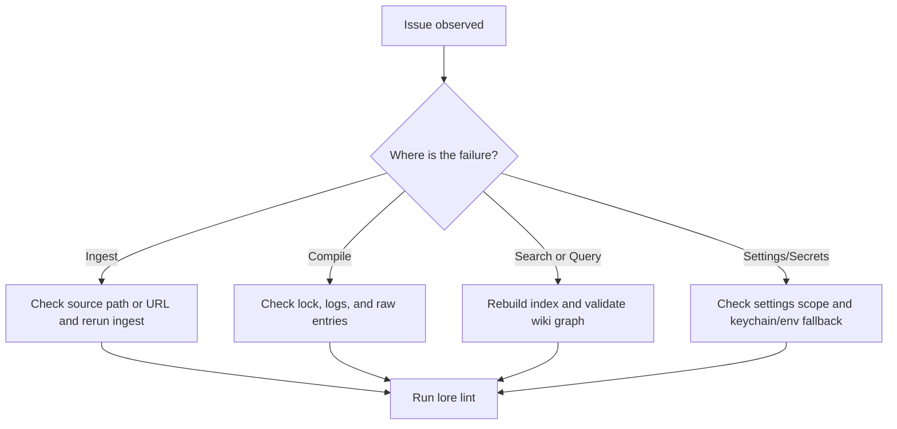

# Troubleshooting

Use this page when Lore commands succeed syntactically but outputs are missing, stale, or low quality.

## Quick Triage Flow



## Common Issues

| Symptom | Likely cause | What to do |
|---|---|---|
| `Another compile is already running` | `.lore/compile.lock` is held by a live process | Wait and rerun compile. If process died, rerun compile and Lore will reclaim stale lock |
| `Compiled 0 articles` unexpectedly | No extracted content changed and hash-based incremental compile skipped work | Use `lore compile --force` to reprocess all valid raw entries |
| Search results are stale or empty | Index drift or missing manifest entries | Run `lore index --repair`, then retry search/query |
| Query answer is low-signal | Retrieval context is weak or ambiguous | Run `lore lint`, inspect gaps/orphans, improve linking, then recompile |
| No QA file created from query | `--no-file-back` was used | Omit `--no-file-back` or check `.lore/wiki/derived/qa/` |
| Angela fails after install | Git history is too shallow or no diff between last two commits | Ensure at least two commits and rerun `lore angela run` manually |
| Export fails on `pdf` | Puppeteer/browser dependency issue | Reinstall dependencies and retry `lore export pdf` |

## Recovery Playbooks

### Compile appears stuck

```bash
# 1) inspect active lore processes
ps aux | grep lore

# 2) retry compile
lore compile

# 3) if still blocked, run a full maintenance pass
lore index --repair
lore lint
```

### Search or query quality regressed

```bash
# 1) refresh index and manifest consistency
lore index --repair

# 2) check graph health
lore lint --json

# 3) ask a focused question again
lore query "How does compile locking work?" --normalize-question
```

### Export artifact missing expected content

```bash
# 1) ensure fresh wiki material exists
lore compile --force

# 2) export again in the target format
lore export bundle --out ./dist

# 3) inspect output quickly
wc -l ./dist/bundle.md
```

## Log-Driven Debugging

`lore ingest`, `lore compile`, and `lore query` produce JSONL logs in `.lore/logs/`.

Use these when a command fails without enough terminal detail:

```bash
# newest logs first
ls -lt .lore/logs | head

# inspect one run log
cat .lore/logs/<run-id>.jsonl
```

## Escalation Checklist

Before opening an issue or asking for help, collect:

1. Command and flags used
2. Whether `--json` output was captured
3. Relevant `.lore/logs/<run-id>.jsonl` snippet
4. Output of `lore lint --json`
5. Whether `lore index --repair` changed behavior

## Related Docs

- [Compiling Your Wiki](./compiling-your-wiki.md)
- [Searching and Querying](./searching-and-querying.md)
- [Exporting](./exporting.md)
- [CLI Reference](../reference/cli-reference.md)
