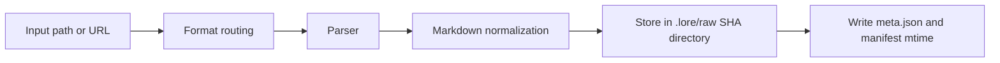

# Supported Formats

This page is the ingest/export compatibility reference for Lore.

## Ingest Formats

| Format | Parser | Requirements | Notes |
|---|---|---|
| `.md` | Direct | None | Markdown preserved through normalization |
| `.txt` | Direct | None | Treated as plain text |
| `.html` / `.htm` | HTML parser | None | Converted to markdown before normalization |
| `.json` / `.jsonl` | JSON parser | None | Attempts conversation transcript detection first |
| `.pdf` | Replicate Marker | Replicate token | Uses Marker model on Replicate |
| `.docx` / `.pptx` / `.xlsx` / `.epub` | Replicate Marker | Replicate token | Parsed as document formats via Marker |
| Images (`.png`, `.jpg`, `.jpeg`, `.webp`, `.gif`, `.bmp`, `.tiff`) | Replicate Vision | Replicate token | OCR + descriptive extraction |
| URLs | Cloudflare BR or Jina | Optional CF credentials | Cloudflare first if credentials are present |
| Video URLs | `yt-dlp` subtitle pipeline | `yt-dlp` recommended | Falls back to URL parser when subtitles unavailable |

## Ingest Pipeline Overview



## Session Framework Sources

Lore can ingest local session history directly using:

```bash
lore ingest-sessions [framework|all]
```

| Framework key | Default source locations (OS-dependent) | Typical file types |
|---|---|---|
| `claude-code` | `~/.claude/projects/` | `.jsonl` |
| `codex-cli` | `~/.codex/sessions/`, `~/.codex/projects/` | `.jsonl` |
| `copilot-cli` | `~/.copilot/session-state/` (or `COPILOT_HOME`) | `events.jsonl` |
| `copilot-chat` | VS Code workspace storage `*/chatSessions/` | `.jsonl`, `.json` |
| `cursor` | Cursor workspace storage | `.jsonl`, `.json` |
| `gemini-cli` | `~/.gemini/`, `~/.config/gemini/` | `.jsonl`, `.json`, `.md` |
| `obsidian` | `~/Documents/Obsidian Vault/` (or custom roots) | `.md` |

Notes:

- Session imports run through the same raw ingest pipeline and produce `.lore/raw/<sha>/` entries.
- `meta.json` now includes `session` metadata for framework-ingested sources.
- `--dry-run` lets you audit discovery before writing ingest output.

## Conversation Export Support (`.json` / `.jsonl`)

Lore attempts schema detection before generic JSON rendering.

Recognized schema families:

- role/content message arrays (`user`/`assistant`, including `human`/`ai` role variants)
- ChatGPT mapping exports (`mapping` graph)
- Claude-style and Codex-style JSONL session events
- Slack-like message arrays

Conversation outputs are normalized as transcript markdown with quoted user lines and assistant response blocks.

### Schema Matrix

| Input shape | Detection result | Output |
|---|---|---|
| Array/object with role-content messages | Conversation transcript | `# Conversation Transcript` markdown |
| ChatGPT mapping object | Conversation transcript | Ordered user/assistant turns |
| JSONL session events | Conversation transcript | Ordered turns from event payloads |
| Slack message arrays | Conversation transcript | Heuristic alternating role mapping |
| No recognized schema | Generic JSON render | Heading/value markdown conversion |

If a file does not match known conversation patterns, Lore falls back to generic JSON-to-markdown conversion.

## URL and Video Behavior

### URL content

- Cloudflare Browser Rendering is used when both `LORE_CF_ACCOUNT_ID` and `LORE_CF_TOKEN` are set
- On Cloudflare failure, Lore logs fallback and uses Jina
- Without Cloudflare credentials, Lore fetches through Jina directly

### Video URLs

- Lore checks for `yt-dlp`
- If subtitles are available, Lore ingests cleaned transcript text
- If `yt-dlp` is missing or subtitles are unavailable/empty, Lore falls back to URL parsing

Extractor metadata is stored in `meta.json` for video ingests.

## Raw Metadata Notes

- all ingests create `.lore/raw/<sha256>/meta.json`
- local file ingests can infer folder-derived tags
- extracted text can append heuristic memory tags (`decision`, `preference`, `problem`, `milestone`, `emotional`)
- duplicate ingests reuse existing raw entries

## Export Formats

Lore supports these export targets:

- `bundle`
- `slides`
- `pdf`
- `docx`
- `web`
- `canvas`
- `graphml`

See [Exporting](../guides/exporting.md) for detailed use cases and output examples.

## Practical Examples

```bash
# ingest a mixed folder
lore ingest ./docs/architecture.md
lore ingest ./notes/session.jsonl
lore ingest ./assets/diagram.png

# ingest a URL and video URL
lore ingest https://example.com/post
lore ingest https://www.youtube.com/watch?v=<id>
```
