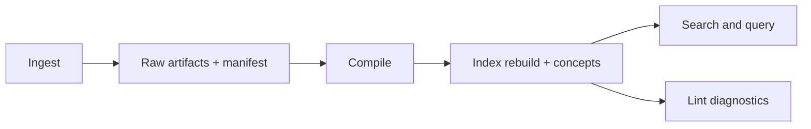

# Architecture

Lore combines markdown-first knowledge storage with an operational pipeline for ingest, compile, retrieval, and quality enforcement.

## 4-Layer Wiki

1. **Index** (`wiki/index.md`) -- always consulted first
2. **Articles** (`wiki/articles/*.md`) -- concept articles with backlinks
3. **Derived** (`wiki/derived/`) -- Q&A answers, slides, charts
4. **Assets** (`wiki/assets/`) -- local images

Supporting state lives in `.lore/`:

- `raw/` normalized ingest artifacts keyed by content hash
- `manifest.json` source-to-raw tracking, compile timestamps, extracted hashes
- `wiki/concepts.json` normalized concept metadata generated after compile
- `db.sqlite` FTS/backlink database
- `compile.lock` active compile mutex file

## Repository Layout Snapshot

| Path | Purpose |
|---|---|
| `.lore/raw/` | Source-derived extracted artifacts keyed by hash |
| `.lore/wiki/articles/` | Compiled concept pages |
| `.lore/wiki/derived/qa/` | Filed query answers |
| `.lore/wiki/concepts.json` | Canonical concept index with aliases/tags/confidence |
| `.lore/db.sqlite` | FTS and link graph tables |
| `.lore/logs/` | JSONL command run logs |

## 4-Phase Pipeline

1. **Ingest** -- `raw/` populated with `extracted.md` + `meta.json`
2. **Compile** -- `wiki/articles/` written, backlinks woven, `wiki/concepts.json` regenerated
3. **Query** -- Q&A via BFS/DFS traversal, filed to `derived/qa/`
4. **Lint** -- orphans, gaps, ambiguous claims, and line-aware diagnostics surfaced

Operationally, these phases are idempotent and can be re-run incrementally.

Compile is hash-incremental by default: unchanged extracted content is skipped based on `manifest.json` `extractedHash` fields.

### Pipeline Diagram

### Compile Reliability Controls

| Control | Purpose |
|---|---|
| PID lock file (`compile.lock`) | Prevent overlapping compile runs |
| Hash-based skipping | Avoid recompiling unchanged extracted content |
| Batch-size retry reduction | Recover from truncation/invalid outputs |
| Post-compile index rebuild | Keep FTS/graph state aligned with article set |

## Ingest and Metadata Flow

Ingest writes `.lore/raw/<sha>/extracted.md` and `.lore/raw/<sha>/meta.json`.

Metadata can include:

- canonical source identity
- folder-derived topical tags
- heuristic memory type tags
- timestamps and provenance fields

Duplicate content is detected by hash and reuses existing raw entries.

Metadata tags can originate from path hints and memory-pattern heuristics to improve downstream classification and discovery.

## Query Flow and Normalization

`query` uses hybrid retrieval from FTS + graph context.

Question text normalization is optional and controlled by:

- CLI flags: `--normalize-question`, `--no-normalize-question`
- env default: `LORE_QUERY_NORMALIZE`

Normalization is intentionally conservative to avoid mutating technical tokens.

Retrieval sequence:

1. load index context
2. run FTS candidate selection
3. expand one-hop neighbors via link graph
4. synthesize answer through LLM

## Graph and Search Storage

SQLite structures:

- `fts`: full-text index (`slug`, `title`, `body`) with ranking/snippets
- `links`: conceptual edges (`from_slug`, `to_slug`)

`lore path` computes shortest conceptual paths via BFS over undirected adjacency derived from `links`.

## Index Integrity and Guardrails

Index rebuild can run in standard or repair mode:

- standard: regenerate DB artifacts from manifest/raw state
- repair: recover missing manifest entries from existing raw folders

Backlink indexing filters low-signal wiki-link targets (for example stopword-only links) to reduce graph noise.

Guardrail benefits:

- fewer noisy edges in concept graph
- cleaner lint gap/orphan signals
- more stable path and neighbor exploration

## MCP Maintenance Surface

The MCP server exposes maintenance and diagnostics tools for automation loops, including:

- duplicate checks before ingest
- raw tag distribution summaries
- orphan/gap/ambiguity lint summaries
- index rebuild and repair triggers

## SQLite Schema

- `fts` -- FTS5 virtual table (slug, title, body) with Porter stemming
- `links` -- backlinks graph (from_slug, to_slug)

## Related Docs

- [Ingest Pipeline](./ingest-pipeline.md)
- [LLM Pipeline](./llm-pipeline.md)
- [Run Logging](./logging.md)
- [Compiling Your Wiki](../guides/compiling-your-wiki.md)
