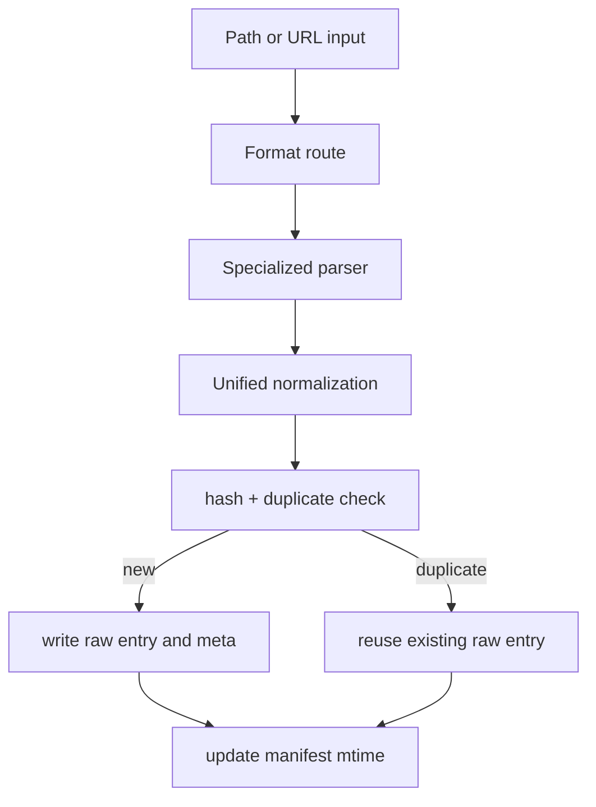

# Ingest Pipeline

Two stages: **format extraction** then **Unified.js normalization**.

Each successful ingest creates a deterministic raw entry in `.lore/raw/<sha256>/`.

## Stage 1: Format Extraction

Routes to the correct parser based on file type or URL pattern.

### Routing Matrix

| Input type | Parser path | Notes |
|---|---|---|
| markdown/text | direct text extraction | normalized by unified pipeline |
| html | HTML parser | converted to markdown |
| json/jsonl | conversation detection + JSON rendering fallback | transcript-first strategy |
| pdf/docx/pptx/xlsx/epub | Replicate Marker | requires Replicate token |
| image formats | Replicate Vision | OCR/caption prompt extraction |
| web page URL | Cloudflare BR `/markdown` endpoint if configured, otherwise Jina | returns markdown directly; Cloudflare failure falls back to Jina |
| document URL (`.pdf`, `.docx`, etc.) | temp download → Replicate Marker | identical path to local document files |
| image URL (`.png`, `.jpg`, etc.) | temp download → Replicate Vision | identical path to local image files |
| video URL | `yt-dlp` subtitle workflow | falls back to URL parsing when unavailable |

### Parser Selection

- Markdown and text-like files route through direct markdown normalization.
- Office/PDF/media formats route through specialized extractors.
- `.json` / `.jsonl` content is schema-checked first for conversation exports.
- URLs with document or image extensions are downloaded to a temp file and routed through the same local extractor (Marker or Vision).
- All other URLs route through fetch/browser extraction based on source and config.

### Video URL Fallback Behavior

1. check `yt-dlp` availability
2. attempt subtitle download and cleanup
3. if missing/empty subtitles, use URL parsing fallback

Extractor provenance is written into raw metadata (`meta.json`).

### Conversation Schema Detection

For JSON inputs, Lore attempts structured conversation extraction before generic rendering. Supported families include:

- role/content arrays
- ChatGPT mapping trees
- Codex/Claude-style JSONL sessions
- Slack-like message arrays

If detection fails, Lore falls back to generic JSON markdown output.

### Conversation Normalization Outcome

Recognized conversation schemas are emitted as transcript markdown under a standard heading (`# Conversation Transcript`) with user turns quoted and assistant turns preserved as prose.

## Stage 2: Unified.js Normalization

1. Parse to mdast AST (remark-parse)
2. Extract YAML frontmatter, resolve `[[wiki-links]]`
3. Normalize heading hierarchy, dedupe whitespace
4. Stringify to `extracted.md`

Normalization goal: produce stable markdown for deterministic hashing and cleaner compile inputs.

## Raw Entry Layout

Each raw directory contains:

- `source` copy (when available)
- `extracted.md` normalized markdown
- `meta.json` ingest metadata

Typical `meta.json` includes:

- content hash and format
- source path or URL provenance
- extraction date/time
- inferred topical and memory tags
- optional extractor identifier (video ingestion)

`meta.json` includes timing/provenance fields and tags that can come from:

- source frontmatter tags
- folder-path inferred topical tags
- heuristic memory signals (`decision`, `preference`, `problem`, `milestone`, `emotional`)

## Duplicate Detection

Ingest computes a source hash and short-circuits when the exact content has already been ingested.

- no duplicate raw directory is created
- existing raw entry is reused
- ingest result includes `duplicate=true`

This keeps `raw/` stable and prevents duplicate article churn downstream.

## Ingest Flow Diagram

## Operational Guardrails

| Guardrail | Benefit |
|---|---|
| deterministic hash identity | duplicate prevention and stable manifest tracking |
| parser fallback chains | resilient ingestion in partially configured environments |
| metadata enrichment | better downstream indexing and maintenance workflows |

## Troubleshooting Signals

| Symptom | Likely cause | Fix |
|---|---|---|
| JSON file not treated as transcript | schema not recognized | inspect structure or rely on generic JSON markdown fallback |
| Video ingest has no transcript | `yt-dlp` unavailable or no subtitles | install `yt-dlp` or accept URL fallback output |
| URL extraction quality is weak | source rendering complexity | configure Cloudflare BR or ingest a local exported copy |

## Interaction With Indexing

`compile` and explicit `index` operations consume `meta.json` + `extracted.md` from `raw/`.

If older manifests reference missing raw directories, index repair mode (`lore index --repair`) rebuilds missing manifest entries by scanning existing raw folders.

## Related Docs

- [Supported Formats](../reference/supported-formats.md)
- [Compiling Your Wiki](../guides/compiling-your-wiki.md)
- [Troubleshooting](../guides/troubleshooting.md)
