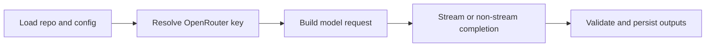

# LLM Pipeline

Lore uses LLM calls in five primary operations, three of which compose the compile pipeline:

1. **Concept Extraction** — extracts named concepts with descriptions and confidence from raw source content
2. **Article Matching** — matches a source's concepts to existing wiki articles
3. **Operation Generation** — produces line-level operations describing how to edit matched articles
4. **Batch Create** — generates new articles for unmatched sources
5. **Q&A (`query`)** — loads `index.md` first, then relevant articles via FTS + graph neighbor expansion; answers question; optionally files result back
6. **Explain** — deep concept synthesis from a matched article plus graph neighbors

The first four compose the compile pipeline (→ concept extraction → matching → operations → creates). All LLM calls go through OpenRouter via the `openai` npm SDK.

`lint` and `index` are not LLM operations; they operate on local markdown and SQLite state.

## End-to-End LLM Flow



## Compile LLM Stages

### 1. Concept Extraction

Each changed source is sent to the LLM with instructions to extract concepts. The LLM returns a JSON array:

```json
[
  {
    "name": "Authentication",
    "description": "User authentication via JWT tokens and OAuth2 providers.",
    "confidence": "extracted",
    "for_source": "source_1"
  }
]
```

- **Batch**: All changed sources are sent in a single call.
- **Confidence**: LLM decides per concept (`extracted`, `inferred`, `ambiguous`).
- **`for_source`**: References the source index in the batch (1-based).
- **Zero concepts**: Sources with no extractable concepts proceed to batch create without matching.

### 2. Article Matching

Each source with concepts is matched against the existing article set. The LLM receives:

- Source title, content, and concepts
- List of candidate article slugs (up to 30 when FTS pre-filtered, or full list for small wikis)
- Article bodies with line numbers and provenance stripped

The LLM returns the slugs of matching articles (up to 3 per source) or an empty list if no match.

**Pre-filtering**: For wikis with 200+ articles, an FTS search on concept names narrows candidates to 30. For smaller wikis, all articles are candidates.

### 3. Operation Generation

Per matched source, the LLM generates a JSON array of operations:

```json
[
  {
    "op": "replace",
    "line": "¶2",
    "content": "Updated line content.",
    "sources": ["sha256(extracted)"],
    "confidence": "extracted"
  },
  {
    "op": "insert-after",
    "line": "¶5",
    "content": "New derived insight.",
    "sources": ["sha256(inferred)"],
    "confidence": "inferred"
  }
]
```

The LLM sees matched articles with:
- Line numbers prefixed with `¶` (pilcrow)
- Provenance comments stripped
- `## References` and `## Related` sections hidden

**Confidence per operation**: For edits to existing articles, the LLM sets `confidence` per operation (defaults to `inferred`). For new articles created via batch create, all lines default to `extracted`.

### 4. Batch Create

Unmatched sources (and sources with zero concepts) are batched together. The LLM generates a set of create operations:

```json
[
  {
    "op": "create",
    "slug": "jwt-authentication",
    "title": "JWT Authentication",
    "description": "How the system uses JWT tokens...",
    "lines": [
      { "content": "Line 1 content.", "sources": ["sha256(extracted)"] }
    ],
    "sources": ["sha256"],
    "confidence": "extracted"
  }
]
```

New articles are written with provenance comments and `## References` populated.

## Compile Truncation and Error Handling

Compile validates LLM output before writing files. Responses are retried once when:

- The provider reports truncation (`finish_reason=length`)
- JSON output is not parseable
- Operations are structurally invalid

On retryable failure, compile retries once. If the retry also fails, the source is skipped (logged) and compile continues with remaining sources. The compile does not abort on individual source failures.

## maxTokens Semantics

- `maxTokens` is optional in `.lore/config.json`.
- If set, Lore includes `max_tokens` in OpenRouter requests.
- If unset, Lore omits `max_tokens` and uses provider/model defaults.

## Retrieval-Side Prompting

### Query

- context composition: index + selected article bodies
- source tracking: slugs returned and optionally filed in derived QA markdown
- optional normalization: conservative query cleanup via flag or env default

### Explain

- exact slug lookup first, then FTS fallback
- neighbor expansion to enrich context window
- long-form synthesis with wiki-style references

## Runtime Controls

| Control | Effect |
|---|---|
| `temperature` | output diversity and determinism tradeoff |
| `maxTokens` | response length ceiling if configured |
| `LORE_QUERY_NORMALIZE` | default query normalization toggle |

## Failure Modes and Recovery

| Symptom | Likely cause | Recovery |
|---|---|---|
| compile retries frequently | malformed LLM output or token limits | allow retry; tune model/maxTokens if persistent |
| query result low quality | weak/limited retrieval context | run index repair, improve links, retry |
| explain misses concept | no exact/fts match | recompile and use clearer concept name |
| sources consistently get zero concepts | content too abstract or short for concept extraction | review raw content; may need manual curation |
| operations fail validation | LLM produced invalid line references | compile skips source and continues; review raw content |

## Run Logging

- Compile and query runs emit structured JSONL events in `.lore/logs/<runId>.jsonl`.
- Token stream events are logged with raw token text.
- Command stderr shows concise run start/end summaries with run ID and log path.

## Related Docs

- [LLM Models](../reference/llm-models.md)
- [Configuration](../guides/configuration.md)
- [Compiling Your Wiki](../guides/compiling-your-wiki.md)
- [Searching and Querying](../guides/searching-and-querying.md)
- [Architecture](./architecture.md)
