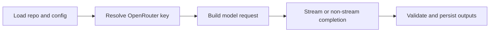

# LLM Pipeline

Lore uses LLM calls in three primary operations:

1. **Compile** -- batch raw `extracted.md` files (up to 20 per call); produces wiki articles with `[[backlinks]]` and YAML frontmatter
2. **Q&A (`query`)** -- loads `index.md` first, then relevant articles via FTS + graph neighbor expansion; answers question; optionally files result back
3. **Explain** -- deep concept synthesis from a matched article plus graph neighbors

All LLM calls go through OpenRouter via the `openai` npm SDK.

`lint` and `index` are not LLM operations; they operate on local markdown and SQLite state.

## End-to-End LLM Flow

## Compile Truncation Handling

Compile validates model output before writing article files. Responses are treated as retryable when:

- the provider reports truncation (`finish_reason=length`)
- an article is structurally incomplete (for example unterminated YAML frontmatter)
- no valid article blocks are returned

On retryable failure, compile automatically retries with smaller batch sizes until batch size 1. If truncation still occurs at batch size 1, compile fails with an actionable error and does not write partial article files.

Retry triggers include:

- provider `finish_reason=length`
- no parseable article blocks
- structurally invalid article output (for example unterminated frontmatter)

## maxTokens Semantics

- `maxTokens` is optional in `.lore/config.json`.
- If set, Lore includes `max_tokens` in OpenRouter requests.
- If unset, Lore omits `max_tokens` and uses provider/model defaults.

## Retrieval-Side Prompting

### Query

- context composition: index + selected article bodies
- source tracking: slugs returned and optionally filed in derived QA markdown
- optional normalization: conservative query cleanup via flag or env default

### Explain

- exact slug lookup first, then FTS fallback
- neighbor expansion to enrich context window
- long-form synthesis with wiki-style references

## Runtime Controls

| Control | Effect |
|---|---|
| `temperature` | output diversity and determinism tradeoff |
| `maxTokens` | response length ceiling if configured |
| `LORE_QUERY_NORMALIZE` | default query normalization toggle |

## Failure Modes and Recovery

| Symptom | Likely cause | Recovery |
|---|---|---|
| compile retries frequently | oversized batch context or token limits | allow auto batch reduction or tune model/maxTokens |
| query result low quality | weak/limited retrieval context | run index repair, improve links, retry |
| explain misses concept | no exact/fts match | recompile and use clearer concept name |

## Run Logging

- Compile and query runs emit structured JSONL events in `.lore/logs/<runId>.jsonl`.
- Token stream events are logged with raw token text.
- Command stderr shows concise run start/end summaries with run ID and log path.

## Related Docs

- [LLM Models](../reference/llm-models.md)
- [Configuration](../guides/configuration.md)
- [Compiling Your Wiki](../guides/compiling-your-wiki.md)
- [Searching and Querying](../guides/searching-and-querying.md)
