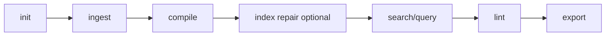

# Schnellstart

Dieser Schnellstart durchläuft den gesamten Lore-Lebenszyklus: Initialisieren, Aufnehmen, Kompilieren, Abrufen, Validieren und Exportieren.

## 1) Initialisieren

```bash
lore init
```

Erwartetes Ergebnis: `.lore/` wird mit Basis-Konfiguration und Speicherstruktur erstellt.

## 2) Inhalte aufnehmen

```bash
# lokale Datei
lore ingest ./README.md

# URL
lore ingest https://example.com/article
```

Erwartetes Ergebnis: neue `.lore/raw/<sha256>/`-Einträge mit `extracted.md` und `meta.json`.

## 3) Zu Wiki-Artikeln kompilieren

```bash
lore compile
```

Erwartetes Ergebnis: `.lore/wiki/articles/*.md`, aktualisiertes `.lore/wiki/index.md`, aktualisierter Suche/Link-Index. Artikel tragen inline-Herkunftsmarkierungen, die verfolgen, welche Quellen zu jeder Zeile beigetragen haben.

Nach einem Upgrade von einer älteren Lore-Version, führen Sie `lore compile --concepts-only` aus, um die Herkunft für vorhandene Artikel nachzufüttern.

## 4) Suchen und abfragen

```bash
# lexikalische Entdeckung
lore search "concept"

# Graph + LLM-Antwort
lore query "What is the architecture?"
```

## 5) Graph-Gesundheit validieren

```bash
lore lint --json
```

Verwenden Sie die Lint-Ausgabe, um Lücken, Waisen und mehrdeutige Artikel zu identifizieren.

## 6) Artefakte exportieren

```bash
lore export bundle
```

Standard-Ausgabeort: `.lore/exports`.

## Optional: Autokompilierung nach Aufnahme

```bash
# Autokompilierung aktivieren — Aufnahme führt automatisch Kompilierung aus
lore settings set autoCompile true --scope repo
```

Wenn aktiviert, führen `lore ingest` und `lore ingest-sessions` automatisch `lore compile` nach Abschluss der Aufnahme aus. Deaktivieren mit `lore settings set autoCompile false --scope repo`.

## Optional: Reparatur-first-Indexierung

```bash
# nützlich nach teilweisen Kopien/unterbrochenen Operationen
lore index --repair
```

## End-to-End-Skript

```bash
lore init
lore ingest ./README.md
lore ingest https://example.com/article
lore compile
lore index --repair
lore lint --json
lore query "What changed in architecture?"
lore export bundle
```

## Schnellstart-Flow



## Nächste Schritte

- [Ihr Wiki kompilieren](../guides/compiling-your-wiki.md)
- [Fehlerbehebung](../guides/troubleshooting.md)
- [Linting und Gesundheit](../guides/linting-and-health.md)
- [Exportieren](../guides/exporting.md)
- [CLI-Referenz](../reference/cli-reference.md)
