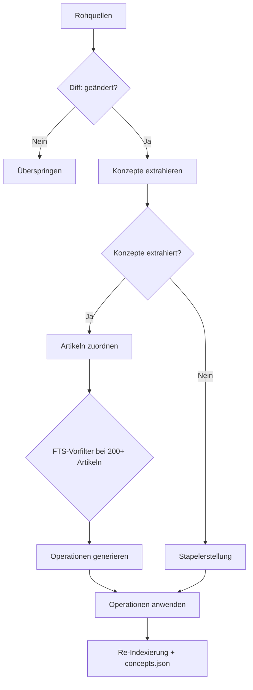

# Ihr Wiki kompilieren

```bash
lore compile [--force] [--concepts-only]
```

Die Kompilierung wandelt rohe extrahierte Dokumente in strukturierte Wiki-Artikel mit `[[wiki-links]]`, YAML-Frontmatter, Konfidenz-Labels und absatzweiser Herkunftsnachverfolgung um.

## Kompilierungspipeline (6 Schritte)

Jede `lore compile`-Ausführung führt eine sechsstufige Pipeline aus:

1. **Diff** — Vergleicht `extractedHash` in `manifest.json` mit rohem Inhalt. Nur geänderte Quellen fahren fort. `--force` umgeht diese Prüfung.
2. **Konzepte extrahieren** — Das LLM extrahiert benannte Konzepte mit Beschreibungen und Konfidenz aus jeder geänderten Quelle.
3. **Zuordnen** — Die Konzepte jeder Quelle werden mit bestehenden Wiki-Artikeln abgeglichen. Quellen ohne Konzepte überspringen zur Stapelerstellung. Für Wikis mit 200+ Artikeln filtert FTS die Kandidatenliste vor.
4. **Operationen generieren** — Für jede zugeordnete Quelle gibt das LLM eine Liste zeilenweiser Operationen aus, die beschreiben, wie die zugeordneten Artikel bearbeitet werden sollen.
5. **Operationen anwenden** — Operationen werden auf Datenträger angewendet: Artikel werden direkt modifiziert, neue Artikel erstellt, veraltete Artikel werden soft-deleted nach `.lore/wiki/deprecated/`.
6. **Re-Indexierung** — Der FTS-Index, Backlink-Graph und `concepts.json` werden neu erstellt, um den aktualisierten Artikelsatz widerzuspiegeln.



## Herkunftsnachverfolgung

Lore verfolgt, welche Quellen zu welchen Zeilen jedes Artikels beigetragen haben. Zwei Mechanismen arbeiten zusammen:

### Inline-Herkunft

Jede Zeile kann einen inline-HTML-Kommentar tragen, der Quellen-Hashes und Konfidenz aufzeichnet:

```markdown
The authentication service uses JWT tokens. <!-- sources:abc123(extracted) def456(inferred) -->
```

Das Format ist `<!-- sources:HASH(CONFIDENCE) ... -->`. Konfidenz-Labels sind pro Operation:

| Label | Bedeutung |
|---|---|
| `extracted` | Direkt in Quelldokumenten angegeben |
| `inferred` | Angemessene LLM-Ableitung |

Wenn das LLM Artikeleinhalt für Zuordnung und Operationserstellung liest, werden inline-Herkunftskommentare entfernt. Das LLM sieht saubere, nummerierte Zeilen ohne Quellenanmerkungen.

### Kumulative Referenzen

Jeder Artikel enthält einen `## References`-Abschnitt am Ende, der alle jemals in diesen Artikel zusammengeführten Quellen-Hashes auflistet:

```markdown
## References
- abc123 (extracted)
- def456 (inferred)
- ghi789 (extracted)
```

Dieser Abschnitt wird vom System automatisch verwaltet. Wenn das LLM Operationen generiert, werden `## References` und `## Related`-Abschnitte aus seinem Kontextfenster ausgeblendet.

### Verwandter Abschnitt

Das System generiert automatisch einen `## Related`-Abschnitt aus `[[wiki-links]]`, die im Artikelkörper gefunden werden. Links werden dedupliziert und sortiert.

## Operationsmodell

Das LLM gibt ein JSON-Array zeilenweiser Operationen aus. Jede Operation zielt auf bestimmte Zeilen in zugeordneten Artikeln ab und enthält ein `sources`-Feld zur Herkunftsnachverfolgung.

| Operation | Beschreibung |
|---|---|
| `replace` | Inhalt einer einzelnen Zeile ersetzen |
| `insert-after` | Eine neue Zeile nach einer Zielzeile einfügen |
| `delete-range` | Einen Zeilenbereich entfernen (Anfang bis Ende, inklusiv) |
| `replace-range` | Einen Zeilenbereich mit neuem Inhalt ersetzen |
| `split` | Einen Artikel in zwei aufteilen: Teil am aktuellen Slug beibehalten, Rest in neuen Slug verschieben |
| `append-source` | Einen Quellen-Hash zu vorhandenen Zeilen hinzufügen, ohne Inhalt zu ändern (nur Konfidenz-Aktualisierung) |
| `soft-delete` | Einen Artikel als veraltet markieren (umbenannt von seinem Slug) |

### Operationsformat

```json
[
  {
    "op": "replace",
    "line": "¶2",
    "content": "Updated content for line 2.",
    "sources": ["abc123(extracted)"],
    "confidence": "extracted"
  },
  {
    "op": "insert-after",
    "line": "¶3",
    "content": "New insight from source.",
    "sources": ["abc123(extracted)"],
    "confidence": "extracted"
  },
  {
    "op": "delete-range",
    "start": "¶5",
    "end": "¶7"
  }
]
```

Zeilenreferenzen verwenden das `¶` (Pilcrow)-Symbol, um sie von YAML-Frontmatter-Zeilennummern zu unterscheiden. Das LLM sieht Artikel mit pilcrow-präfigierten Zeilennummern im Kontext.

### Multi-Artikel-Bearbeitung

Eine einzige Quelle kann Operationen generieren, die mehrere vorhandene Artikel betreffen. Das System wendet Operationen sequenziell pro Quelle an und aktualisiert die Artikelliste nach den Bearbeitungen jeder Quelle, um Aufteilungen und neue Artikel zu behandeln.

### Soft Delete

Wenn ein Artikel nicht mehr relevant ist, gibt das LLM eine `soft-delete`-Operation aus. Der Artikel wird in einen `.deprecated-{slug}-{timestamp}.md`-Pfad unter `.lore/wiki/deprecated/` umbenannt. Er verschwindet aus der Suche und dem Link-Graphen, aber die Datei wird für Audit-Zwecke aufbewahrt.

## Hash-basierte inkrementelle Kompilierung

Lore verfolgt ein `extractedHash` pro Roh-Eintrag in `.lore/manifest.json`.

- Standardverhalten: kompiliert nur Einträge, deren extrahierter Inhalt geändert wurde.
- Erste Ausführung nach Upgrade: zuvor kompilierte Einträge ohne `extractedHash` werden einmal neu kompiliert und dann aktualisiert.
- `--force`: umgeht Hash-Prüfungen und kompiliert alle gültigen Roh-Einträge neu.

## Concepts-Only-Modus

```bash
lore compile --concepts-only
```

Füllt Herkunft für Artikel nach, die vor der Einführung der Herkunftsnachverfolgung kompiliert wurden. Es:

1. Liest jeden Artikel unter `.lore/wiki/articles/`.
2. Für Artikel ohne inline `<!-- sources:`-Kommentare wendet es Nachfüll-Logik an (gesamter Körper mit generischen Quellen-Hashes markiert).
3. Erstellt `concepts.json` und den Suchindex neu.

Verwenden Sie dies einmal nach dem Upgrade von einer pre-Herkunft-Version von Lore. Es kompiliert Artikel nicht neu oder ändert den Artikeleinhalt über das Hinzufügen von Herkunftsmarkierungen hinaus.

## Stapel-Verhaltenswiederholung

Compile verarbeitet Quellen sequenziell (Zuordnung) und stapelweise (Erstellung). Wenn eine Antwort wiederholbar ist (abgeschnittene Ausgabe, ungültiges JSON, unparstbare Operationen), wiederholt Lore einmal.

| Bedingung | Verhalten |
|---|---|
| LLM-Antwort abgeschnitten | Einmal wiederholen |
| Ungültige JSON-Operationsausgabe | Einmal wiederholen |
| Wiederholung schlägt immer noch fehl | Quelle überspringen, Fehler protokollieren, Kompilierung fortsetzen |

Die Kompilierung bricht nicht bei individuellen Quellenfehlern ab. Ungültige Operationen werden protokolliert und die betroffene Quelle wird übersprungen.

## Compile-Lock und Parallelität

Lore schützt Compile mit `.lore/compile.lock`, um überlappende Ausführungen zu verhindern.

- Wenn ein anderes aktives Compile läuft, schlägt `lore compile` schnell mit einer umsetzbaren Fehlermeldung fehl.
- Veraltete oder fehlerhafte Lock-Inhalte werden automatisch zurückgewonnen.
- Wenn `autoCompile` in der Repo-Konfiguration aktiviert ist, lösen Ingest-Befehle automatisch Compile aus und respektieren dasselbe Lock.

Die Lock-Datei speichert eine Prozess-ID (PID). Wenn diese PID nicht mehr aktiv ist, entfernt Lore das veraltete Lock und versucht die Erneuerung.

## Index-Neuerstellung und Reparatur

Halten Sie nach Compile den Suche- und Graphenzustand frisch:

```bash
lore index
```

Wenn Roh-Einträge existieren, aber `manifest.json` abgewichen ist (z.B. nach teilweiser Kopie oder unterbrochenen Ausführungen):

```bash
lore index --repair
```

`--repair` rekonstruiert fehlende Manifest-Einträge aus `.lore/raw/` vor der Index-Neuerstellung.

## Konzeptmetadaten-Ausgabe

Nach erfolgreicher Kompilierung und Index-Neuerstellung schreibt Lore `.lore/wiki/concepts.json`:

- `updatedAt` — Zeitstempel
- `concepts[]` Einträge mit `slug`, `canonical`, `title`, `aliases`, `tags`, `confidence`

Die Alias-Generierung ist deterministisch und umfasst Slug-Aliase, Konjunktions-Swap-Varianten (`A and B` → `B and A`) und Akronyme für Titel mit 3+ Wörtern.

## Graph-Schutzmaßnahmen

Bei der Index-Neuerstellung filtert Lore Link-Ziele mit geringem Signal (z.B. `[[it]]`, `[[the]]`), um rauschhafte Graphkanten zu vermeiden.

- Vorteil: besseres `lore path`, sauberere Nachbarschaftsmengen, lint-Ausgabe mit höherem Signal.
- Kompromiss: bewusst generische Links werden verworfen, es sei denn, sie werden bedeutungsvollen Konzept-Token zugeordnet.

## Empfohlener Kompilierungs-Workflow

```bash
# aufnehmen und kompilieren
lore ingest ./docs
lore compile

# Index und Graph aktualisieren
lore index --repair

# Graph-Gesundheit inspizieren
lore lint
```

Nach Upgrade von einer älteren Version:

```bash
# Herkunft für vorhandene Artikel nachfüttern
lore compile --concepts-only
```

## Autokompilierung-Einstellung

Setzen Sie `autoCompile` in der Repo-Konfiguration, um nach jeder Aufnahme automatisch zu kompilieren:

```bash
lore settings set autoCompile true --scope repo
```

Wenn aktiviert:

- `lore ingest` führt Compile nach Abschluss der Aufnahme automatisch aus
- `lore ingest-sessions` führt Compile einmal aus, nachdem alle Sitzungen aufgenommen wurden
- Das MCP `ingest`-Tool kompiliert ebenfalls automatisch, wenn die Einstellung aktiv ist
- Das Compile-Lock verhindert überlappende Ausführungen — ein bereits laufendes Compile blockiert neue
- Deaktivieren mit `lore settings set autoCompile false --scope repo`

## Fehlerbehebung bei Compile-Ausführungen

| Symptom | Wahrscheinliche Ursache | Lösung |
|---|---|---|
| Häufige Wiederholungen | Fehlformatierte LLM-Ausgabe oder übergroßer Kontext | Lassen Sie die Wiederholung ablaufen; stimmen Sie Modell/maxTokens bei andauerndem Problem ab |
| Lock-Fehler in Automatisierung | Ein anderer Compile-Prozess aktiv | Serialisieren Sie Compile-Jobs und versuchen Sie es später erneut |
| Keine neuen Artikel geschrieben | Inkrementeller Hash überspringt unveränderte Einträge | Verwenden Sie `lore compile --force` |
| Index erscheint nach Fehlern veraltet | Compile vor Index-Neuerstellung unterbrochen | Führen Sie `lore index --repair` manuell aus |
| Quellen mit null Konzepten übersprungen | LLM konnte keine Konzepte aus Inhalt extrahieren | Inhalt muss möglicherweise manuell überprüft werden; mit reicherem Quellmaterial neu aufnehmen |
| Alte Artikel ohne Herkunft | Artikel vor Einführung der Herkunft kompiliert | Führen Sie `lore compile --concepts-only` aus |

## Verwandte Dokumente

- [Schnellstart](../getting-started/quickstart.md)
- [Linting und Gesundheit](./linting-and-health.md)
- [Fehlerbehebung](./troubleshooting.md)
- [CLI-Referenz](../reference/cli-reference.md)
- [Architektur](../technical/architecture.md)
- [LLM-Pipeline](../technical/llm-pipeline.md)
