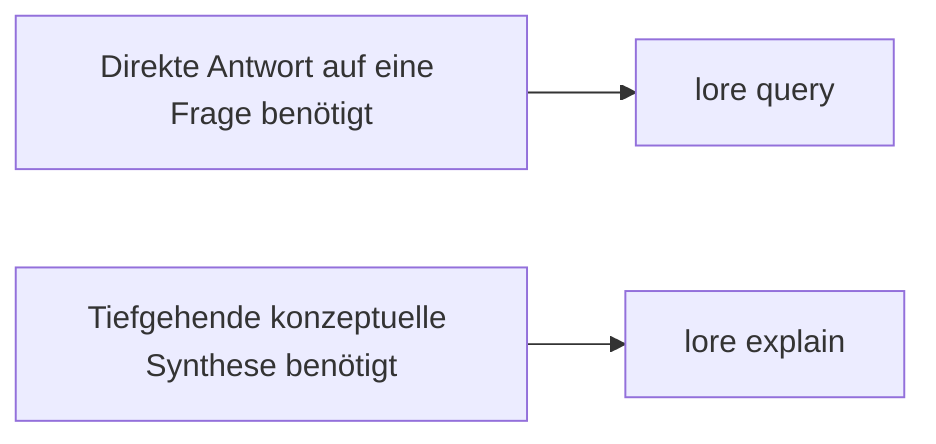

# Explain-Befehl

```bash
lore explain "<concept>" [--json]
```

`lore explain` bietet eine tiefgehende Konzeptdurchführung, indem der Haupt-Zugeordnete Artikel mit nahegelegenen Graph-Nachbarn kombiniert wird.

## Query vs. Explain



| Befehl | Am besten für | Ausgabeform |
|---|---|---|
| `lore query` | Direkte Fragenbeantwortung | Antworttext plus Quellen-Slugs |
| `lore explain` | Konzept-Tiefgänge | Langform-Erklärung plus verwandte Quellen-Slugs |

## So wählt Explain Kontext aus

1. Versucht exakten Slug-Match für das Konzept
2. Fällt auf FTS-Match zurück, wenn exakter Slug fehlt
3. Lädt Nachbarartikel aus Graph-Links
4. Synthetisiert eine detaillierte Erklärung aus kombiniertem Kontext

## Beispiele

```bash
# menschenlesbarer Tiefgang
lore explain "Compile Lock"

# skriptfreundlich
lore explain "MCP Server" --json
```

Beispiel JSON-Antwort:

```json
{
  "explanation": "...long-form explanation...",
  "sources": ["compile-lock", "watch-mode", "index-repair"]
}
```

## Integrations-Anwendungsfälle

- Onboarding-Tiefgänge für neue Ingenieure
- Architektur-Review-Vorbereitung vor Designbesprechungen
- Agent-Workflows, die breiten konzeptuellen Kontext statt einmaliger Antworten benötigen

## Fehlerbehebung

| Symptom | Wahrscheinliche Ursache | Lösung |
|---|---|---|
| `No article found for <concept>` | Konzept ist noch nicht indexiert | Führen Sie `lore compile` aus, dann mit präzisem Konzeptnamen erneut versuchen |
| Erklärung zu flach | Nachbarschaftskontext spärlich | Wiki-Links verbessern und compile/index erneut ausführen |
| Quellen scheinen nicht verwandt | FTS-Fallback hat breiten Begriff zugeordnet | Verwenden Sie einen spezifischeren Konzeptnamen |

## Verwandte Dokumente

- [Suchen und Abfragen](./searching-and-querying.md)
- [Ihr Wiki kompilieren](./compiling-your-wiki.md)
- [Fehlerbehebung](./troubleshooting.md)
- [CLI-Referenz](../reference/cli-reference.md)
