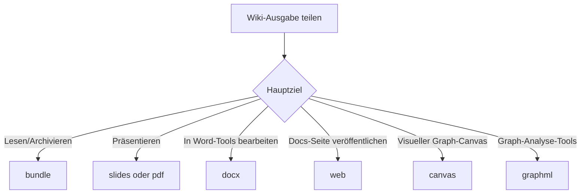

# Exportieren

```bash
lore export <format> [--out <dir>] [--json]
```

Verwenden Sie Exporte, wenn Sie Ihr Wiki außerhalb von Lore teilen oder analysieren möchten.

- Standard-Ausgabeverzeichnis: `.lore/exports`
- Benutzerdefiniertes Ausgabeverzeichnis: `--out <dir>`
- Maschinenlesbare Ausgabe: `--json` gibt `format`, `outputPath` und `bytesWritten` zurück

## Export-Entscheidungsflow



## Formate

| Format | Ausgabe | Am besten für | Hinweise |
|---|---|---|---|
| `bundle` | `bundle.md` | Archivierung, Offline-Lesen, schnelles Teilen | Verkettet Index + alle Artikel-Markdown |
| `slides` | `slides.md` | Präsentationen mit Marp | Teilt Inhalt in Abschnitte und Folienumbrüche |
| `pdf` | `wiki.pdf` | Stakeholder-Review und Schnappschüsse | Verwendet einen grundlegenden HTML-Renderer über Puppeteer |
| `docx` | `wiki.docx` | Bearbeitung in Word-ähnlichen Tools | Konvertiert Markdown-Überschriften/Aufzählungen/Absätze |
| `web` | `web/` Projekt | Veröffentlichen einer durchsuchbaren Wiki-Seite | Erstellt Astro + Starlight-Projekt |
| `canvas` | `wiki.canvas` | Knoten-Link-Visualisierung | JSON Canvas 1.0 mit Rasterlayout-Knoten |
| `graphml` | `wiki.graphml` | Gephi/yEd und Graph-Analyse | Gerichteter Graph aus Wiki-Backlinks |

## Häufige Nutzung

```bash
# Standard-Ausgabe: .lore/exports
lore export bundle

# benutzerdefiniertes Ausgabeverzeichnis
lore export web --out ./artifacts/wiki-web

# skriptfreundliche Antwort
lore export graphml --json
```

Beispiel JSON-Antwort:

```json
{
	"format": "graphml",
	"outputPath": "/repo/.lore/exports/wiki.graphml",
	"bytesWritten": 84211
}
```

## Format-Durchgänge

### `bundle`

```bash
lore export bundle
```

Erstellt ein Markdown-Dokument mit Ihrem Index gefolgt von allen Artikeln, getrennt durch `---`-Trennzeichen.

Anwendungsfälle:

- Einzeldatei-Review in Editoren
- Langform-Archivschnappschüsse
- Eingabe für externe Markdown-Pipelines

### `slides`

```bash
lore export slides --out ./presentation
```

Generiert Marp-kompatibles Markdown mit Frontmatter und aktivierter Paginierung.

Anwendungsfälle:

- Interne Architektur-Briefings
- Wissensübertragungssitzungen
- Release-Demo-Decks

### `pdf`

```bash
lore export pdf
```

Erstellt ein PDF durch Konvertierung des Markdown-Bundles über eine leichtgewichtige HTML-Vorlage und Rendering mit Puppeteer.

Anwendungsfälle:

- Druckfähige Dokumente
- Statische Übergabeartefakte
- Compliance-Schnappschüsse

### `docx`

```bash
lore export docx
```

Konvertiert Wiki-Artikel in eine DOCX-Datei mit zugeordneten Überschriften und Aufzählungslisten.

Anwendungsfälle:

- Gemeinsame Bearbeitung in Office-Suiten
- Formale Review-Workflows
- Redaktionelle Bereinigungsläufe

### `web`

```bash
lore export web
cd .lore/exports/web
npm install
npm run dev
```

Erstellt eine Astro Starlight-Seite und kopiert Ihre Wiki-Seiten in `src/content/docs`.

Anwendungsfälle:

- Interne Docs-Hosting
- Temporäre Vorschauseiten
- Team-Onboarding-Portale

### `canvas`

```bash
lore export canvas
```

Generiert JSON-Canvas-Ausgabe mit Artikelknoten und Backlink-Kanten.

Anwendungsfälle:

- Visuelle Karte von Konzeptbeziehungen
- Planungssitzungen in Canvas-Tools
- Graphorientierte Inhaltsaudits

### `graphml`

```bash
lore export graphml
```

Exportiert einen GraphML-Graphen aus Ihren Artikel/Link-Tabellen für Tools wie Gephi und yEd.

Anwendungsfälle:

- Zentralitäts/Community-Analyse
- Graph-Debugging
- Externe Data-Science-Workflows

## End-to-End-Beispiel

```bash
# 1) Wiki-Zustand aktualisieren
lore ingest ./docs
lore compile

# 2) mehrere Lieferobjekte erstellen
lore export bundle --out ./dist/lore
lore export pdf --out ./dist/lore
lore export web --out ./dist/lore

# 3) generierte Artefakte inspizieren
ls -la ./dist/lore
```

## Fehlerbehebung

| Symptom | Wahrscheinliche Ursache | Lösung |
|---|---|---|
| Export schlägt fehl mit fehlendem Artikelverzeichnis | Wiki wurde noch nicht kompiliert | Führen Sie zuerst `lore compile` aus |
| `pdf`-Export schlägt fehl | Browser-Abhängigkeitsproblem mit Puppeteer | Installieren Sie Abhängigkeiten neu und versuchen Sie `lore export pdf` erneut |
| `web`-Export erstellte Projekt, aber Seite startet nicht | Abhängigkeiten im exportierten Projekt nicht installiert | Führen Sie `npm install` im exportierten `web`-Ordner aus |
| Ausgabe zu groß zum Teilen | Vollständiges Wiki ist groß | Verwenden Sie `bundle` für reinen Text oder segmentieren Sie den Inhalt vor dem Export |

## Verwandte Dokumente

- [Ihr Wiki kompilieren](./compiling-your-wiki.md)
- [Suchen und Abfragen](./searching-and-querying.md)
- [CLI-Referenz](../reference/cli-reference.md)
