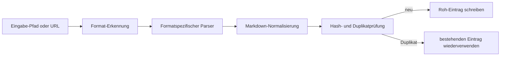

# Inhalte aufnehmen

```bash
lore ingest <path|url>
```

```bash
lore ingest-sessions [framework|all]
```

## Unterstützte Formate

| Format | Methode |
|---|---|
| `.md`, `.txt` | Direkt |
| `.html` | rehype-parse |
| `.json`, `.jsonl` | JSON-Parser (normalisierte unterstützte Chat-Exports automatisch) |
| `.pdf`, `.docx`, `.pptx`, `.xlsx`, `.epub` | Replicate marker |
| Bilder (`.png`, `.jpg`, `.jpeg`, `.webp`, `.gif`, `.bmp`) | Replicate vision |
| URLs (Webseiten) | Cloudflare BR `/markdown`-Endpunkt oder Jina r.jina.ai |
| URLs (Dokumente: `.pdf`, `.docx`, `.pptx`, `.xlsx`, `.epub`) | Temporärer Download → Replicate Marker |
| URLs (Bilder: `.png`, `.jpg`, `.jpeg`, `.webp`, `.gif`, `.bmp`) | Temporärer Download → Replicate Vision |
| Video-URLs | yt-dlp-Untertitel |

Alle aufgenommenen Inhalte werden in `.lore/raw/<sha256>/` mit `extracted.md` und `meta.json` gespeichert.

## Framework-Sitzungs-Aufnahme

Verwenden Sie `lore ingest-sessions`, um den Sitzungsverlauf aus dem lokalen Framework-Speicher zu ziehen.

Unterstützte Framework-Werte:

- `claude-code`
- `codex-cli`
- `copilot-cli`
- `copilot-chat`
- `cursor`
- `gemini-cli`
- `obsidian`
- `all` (Standard)

Beispiele:

```bash
# alle unterstützten Framework-Sitzungsspeicher aufnehmen
lore ingest-sessions all

# nur Claude Code-Sitzungen aufnehmen
lore ingest-sessions claude-code

# nur Discovery ausführen, keine Ingest-Schreibvorgänge
lore ingest-sessions all --dry-run --json

# Standard-Roots überschreiben und Scan-Größe begrenzen
lore ingest-sessions copilot-chat --root ~/Library/Application\ Support/Code/User/workspaceStorage --max-files 200
```

Flags:

- `--root <path...>`: optionaler Root-Pfad zum Scannen statt Standardwerte
- `--max-files <n>`: max. entdeckte Dateien pro Framework (Standard `500`)
- `--dry-run`: nur entdecken, nicht aufnehmen
- `json`: maschinenlesbare Zusammenfassung mit `runId`/`logPath`

## Aufnahme-Flow



## Roh-Eintrag-Struktur

Jeder Roh-Eintrag wird gespeichert unter:

```text
.lore/raw/<sha256>/
	extracted.md
	meta.json
	original.<ext> (oder original.txt für URLs)
```

Beispiel `meta.json`:

```json
{
	"sha256": "<sha256>",
	"format": "json",
	"title": "Conversation Transcript",
	"sourcePath": "/abs/path/to/file.json",
	"date": "2026-04-09T00:00:00.000Z",
	"tags": ["docs", "frontend", "decision"]
}
```

## Ordnerbasierte Themen-Tags

Für lokale Datei-Aufnahme leitet Lore eine kleine Menge Themen-Tags aus Verzeichnisnamen ab und schreibt sie in `meta.json.tags`.

- Beispiele zugeordneter Kategorien sind `frontend`, `backend`, `docs`, `testing`, `tooling`, `infra`, `data`, `mobile` und `design`.
- URL-Aufnahme leitet keine Ordner-Tags ab und behält `tags: []`.
- Tags sind bewusst begrenzt und dedupliziert, sodass Metadaten präzise bleiben.

Lore wendet während der Aufnahme auch leichte Inhaltsheuristiken an und kann semantische Tags wie `decision`, `preference`, `problem`, `milestone` und `emotional` anhängen, wenn übereinstimmende Phrasen erkannt werden.

## Duplikatbewusste Aufnahme

Lore berechnet einen SHA-256-Digest aus der ursprünglichen Eingabe und wiederverwendet vorhandene Roh-Einträge, wenn der Digest bereits existiert.

- Duplikat-Treffer-Verhalten:
	- Parsen/Extrahieren wird übersprungen
	- vorhandene Metadaten werden wiederverwendet
	- manifest-mtime wird aktualisiert
- JSON-Ausgabe enthält `duplicate: true` bei Duplikat-Treffern.

Beispiel:

```bash
lore ingest ./docs/architecture.md --json
```

Mögliche Ausgabefelder:

```json
{
	"sha256": "...",
	"format": "md",
	"title": "Architecture",
	"duplicate": true
}
```

## So funktioniert die Konversations-Export-Aufnahme (`.json` / `.jsonl`)

1. Lore versucht zuerst, bekannte Konversations-Schemas zu erkennen.
2. Wenn ein unterstütztes Schema erkannt wird, schreibt Lore den Inhalt in Transkript-Markdown um:
	- Benutzerzüge werden mit `>` präfigiert
	- Assistentenzüge werden als Antwortblöcke beibehalten
3. Die aktuelle automatische Erkennung zielt auf gängige Exports wie role/content-Arrays, ChatGPT-Mapping-Exports und Codex/Claude-ähnliche JSONL-Logs ab.
4. Wenn kein bekanntes Schema erkannt wird, fällt Lore auf generische JSON-zu-Markdown-Umwandlung zurück.

Unterstützte Konversations-Schema-Familien umfassen:

- role/content-Arrays (`[{"role":"user"...}]`)
- ChatGPT-Mapping-Exports
- Claude/Codex JSONL-Sitzungslogs
- Slack-ähnliche Nachrichten-Arrays

## So funktioniert die PDF-Aufnahme

1. Lore erkennt eine Dokument-Erweiterung wie `.pdf` oder `.docx`.
2. Die Datei wird an Replicate Marker (`cuuupid/marker`) zur Markdown-Extraktion gesendet.
3. Das normalisierte Markdown wird in `.lore/raw/<sha256>/extracted.md` geschrieben.
4. Metadaten und Quellenverfolgung werden in `.lore/raw/<sha256>/meta.json` geschrieben.

## So funktioniert die Webdokument- und Bild-URL-Aufnahme

Lore erkennt die Dateierweiterung im URL-Pfad, um zwischen Webseiten, Dokumenten und Bildern zu unterscheiden.

Für **Dokument-URLs** (endend auf `.pdf`, `.docx`, `.pptx`, `.xlsx`, `.epub`):

1. Lore lädt die Datei in ein temporäres Verzeichnis herunter.
2. Sendet sie durch Replicate Marker — denselben Parser, der für lokale Dokumente verwendet wird.
3. Räumt die temporäre Datei auf, sobald die Extraktion abgeschlossen ist.
4. Speichert das Ergebnis in derselben Roh-Pipeline (`extracted.md` + `meta.json`).

Für **Bild-URLs** (endend auf `.png`, `.jpg`, `.jpeg`, `.webp`, `.gif`, `.bmp`):

1. Lore lädt das Bild in ein temporäres Verzeichnis herunter.
2. Sendet es durch Replicate Vision — denselben Parser, der für lokale Bilder verwendet wird.
3. Räumt die temporäre Datei auf, sobald die Extraktion abgeschlossen ist.
4. Speichert das Ergebnis in derselben Roh-Pipeline.

Für **alle anderen URLs** (Webseiten, HTML, APIs usw.):

1. Ruft Lore den Cloudflare Browser Run `/markdown`-Endpunkt auf, wenn `LORE_CF_ACCOUNT_ID` und `LORE_CF_TOKEN` konfiguriert sind — dies gibt JavaScript-gerendertes Markdown direkt zurück. Standardmäßig wartet Lore auf `networkidle2` (≤2 offene Verbindungen), bevor die Seite erfasst wird. Überschreiben Sie mit `--cf-wait-until networkidle0` für Seiten, die persistente Verbindungen öffnen.
2. Bei Cloudflare-Fehler oder fehlenden Anmeldedaten fällt Lore auf Jina `r.jina.ai` zurück.

> **Anforderungen**: Dokument/Bild-URL-Aufnahme erfordert dieselben Anmeldedaten wie die lokale Dokument/Bild-Aufnahme — ein `TELEPAT_REPLICATE_TOKEN`. Webseiten-Aufnahme erfordert `LORE_CF_ACCOUNT_ID` + `LORE_CF_TOKEN` für Cloudflare (Jina ist die anmeldefreie Alternative).

## So funktioniert die YouTube/Video-Aufnahme

1. Erkennt Lore bekannte Video-Hosts (z.B. YouTube, Vimeo, Twitch).
2. Es versucht die Untertitelextraktion mit `yt-dlp`.
3. Untertitel werden aus VTT in Klartext-Transkript bereinigt.
4. Transkript-Ausgabe wird in derselben Roh-Pipeline gespeichert (`extracted.md` + `meta.json`).
5. Wenn `yt-dlp` nicht verfügbar ist oder Untertitel fehlen, fällt Lore auf URL-Aufnahme-Aufnahme zurück.

Extraktor-Herkunft:

- `meta.json` für Video-Aufnahmen enthält ein `extractor`-Feld.
- `extractor: yt-dlp` zeigt an, dass die Untertitelextraktion erfolgreich war.
- Fallback-Werte umfassen `url-fallback-no-ytdlp`, `url-fallback-no-subs` und `url-fallback-empty-transcript`.

## Verwandte Referenzen

- [Unterstützte Formate](../reference/supported-formats.md)
- [LLM-Modelle](../reference/llm-models.md)
- [Anmeldedaten und Secrets](./credentials-and-secrets.md)

## Fehlerbehebung

- JSON wurde nicht zu Transkript normalisiert:
	- stellen Sie sicher, dass die Datei gültiges JSON/JSONL ist
	- prüfen Sie, ob Datensätze sowohl user/assistant-artige Züge enthalten
	- wenn das Schema unbekannt ist, fällt Lore bewusst auf generisches JSON-Markdown zurück
- Unerwartete Tags:
	- Ordner-Tags sind pfadabgeleitet und begrenzt
	- Heuristische Tags sind phrasengetrieben und konservativ
- URL-Aufnahme-Pfad:
	- URLs, die auf Dokument- oder Bild-Erweiterungen enden (`.pdf`, `.docx`, `.png` usw.), lösen temporären Download und lokalen Parser-Routing aus — identisch mit lokaler Datei-Aufnahme
	- für Webseiten-URLs mit `LORE_CF_ACCOUNT_ID` + `LORE_CF_TOKEN` ruft Lore den Cloudflare Browser Run `/markdown`-Endpunkt direkt auf
	- bei CF-Fehler oder fehlenden Anmeldedaten fällt Lore automatisch auf Jina-Abruf zurück
