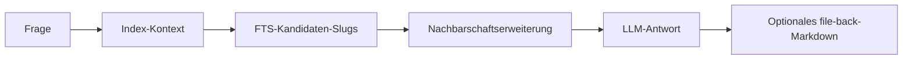

# Suchen und Abfragen

Verwenden Sie diese Befehle zusammen: `search` für Entdeckung, `query` für Antwort-Synthese, `path` für Graph-Konnektivität und `explain` für tiefe konzeptuelle Durchgänge.

## Suche

```bash
lore search "term" [--limit N] [--json]
```

FTS5/BM25-Volltextsuche mit rangfolge-Snippets.

Tipps:

- Bevorzugen Sie fokussierte Nominalphrasen (`"plugin lifecycle"`, `"ingest metadata"`).
- Erhöhen Sie den Recall mit `--limit` bei breiten Themen.
- Suche ist lexikalisch BM25, daher ist Vokabular wichtig.

Beispiele:

```bash
# breite Entdeckung
lore search "compile lock" --limit 15

# präziser Ausdruck
lore search "manifest repair" --limit 5
```

## Abfrage

```bash
lore query "question" [--no-file-back] [--normalize-question] [--json]
```

BFS/DFS-Traversierung des Backlink-Graphen + LLM-Q&A. Antworten können nach `derived/qa/` abgelegt werden.

`--normalize-question` aktiviert konservative Tippfehlerbereinigung vor dem Retrieval unter Beibehaltung technischer Token (z.B. Pfade, IDs, ENV-Variablen, versionierte Begriffe).

Beispiele:

```bash
# genauen Abfragetext beibehalten
lore query "How is index rebuild implemented?"

# Tippfehlerbereinigung anwenden, aber technische Token beibehalten
lore query "teh qurey about src/core/mcp.ts" --normalize-question

# file-back-Nebeneffekte deaktivieren
lore query "What are current gaps?" --no-file-back
```

Die Standardnormalisierung kann auch aktiviert werden mit:

```bash
export LORE_QUERY_NORMALIZE=true
```

Wenn file-back aktiviert ist (Standard), schreibt Lore ein Markdown-Artefakt unter `.lore/wiki/derived/qa/`.

## Pfad

```bash
lore path "Article A" "Article B" [--json]
```

Kürzester konzeptueller Pfad zwischen zwei Artikeln über den Backlink-Graphen.

Beispiel:

```bash
lore path "Compile Lock" "MCP Server"
```

Wenn kein Pfad gefunden wird, gibt der Befehl einen leeren Pfad mit `hops: -1` im JSON-Modus zurück.

## Erklären

```bash
lore explain "concept" [--json]
```

Tiefgehende Erklärung eines Konzepts mit vollständigem Kontext aus verwandten Artikeln.

Verwenden Sie explain, wenn Sie Synthese über benachbarte Konzepte benötigen, statt einer kurzen direkten Antwort.

```bash
lore explain "Incremental Compile" --json
```

## Retrieval-Hinweise

- Query-Flow verwendet index-first-Kontext, dann FTS-Kandidatenartikel, dann Graph-Nachbarschaftserweiterung.
- Antworten enthalten Quellen-Slugs und können unter `wiki/derived/qa/` persistiert werden, sofern nicht deaktiviert.
- `path` ist nur Graph-nützlich und zur Inspektion konzeptueller Konnektivität unabhängig von der LLM-Generierung.

### Query-Retrieval-Flow



Operationelle Details:

- FTS-Stufe wählt Top-Treffer aus
- Nachbarschaftserweiterung fügt One-Hop-verwandte Artikel hinzu
- Kontext wird vor LLM-Synthese begrenzt, um Antworten stabil zu halten

## Fehlerbehebung

- Query gibt低信号 Antwort zurück:
	- `lore index --repair` ausführen und erneut versuchen
	- überprüfen Sie, ob Quellartikel in `.lore/wiki/articles/` vorhanden sind
- Pfad nicht gefunden:
	- `lore lint` ausführen und `gaps` und `orphans` inspizieren
	- bestätigen Sie, dass erwartete Links im Artikel-Markdown als `[[Wiki Links]]` vorhanden sind

## Verwandte Dokumente

- [Explain-Befehl](./explain-command.md)
- [Ihr Wiki kompilieren](./compiling-your-wiki.md)
- [Fehlerbehebung](./troubleshooting.md)
