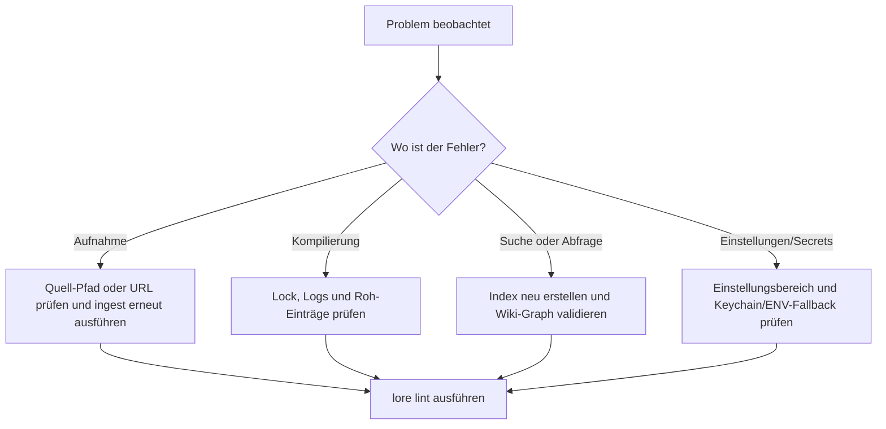

# Fehlerbehebung

Verwenden Sie diese Seite, wenn Lore-Befehle syntaktisch erfolgreich sind, aber Ausgaben fehlen, veraltet oder von niedriger Qualität sind.

## Schneller Triagierungs-Flow



## Häufige Probleme

| Symptom | Wahrscheinliche Ursache | Was zu tun ist |
|---|---|---|
| `Another compile is already running` | `.lore/compile.lock` wird von einem aktiven Prozess gehalten | Warten und compile erneut ausführen. Wenn der Prozess abgestürzt ist, compile erneut ausführen und Lore wird das veraltete Lock zurückgewinnen |
| `Compiled 0 articles` unerwartet | Kein extrahierter Inhalt geändert und hash-basierte inkrementelle Kompilierung hat Arbeit übersprungen | Verwenden Sie `lore compile --force`, um alle gültigen Roh-Einträge neu zu verarbeiten |
| Suchergebnisse veraltet oder leer | Index-Abweichung oder fehlende Manifest-Einträge | Führen Sie `lore index --repair` aus, dann search/query erneut versuchen |
| Query-Antwort低信号 | Retrieval-Kontext schwach oder mehrdeutig | Führen Sie `lore lint` aus, inspizieren Sie Lücken/Waisen, verbessern Sie das Verlinken, dann neu kompilieren |
| Keine QA-Datei aus Query erstellt | `--no-file-back` wurde verwendet | Lassen Sie `--no-file-back` weg oder prüfen Sie `.lore/wiki/derived/qa/` |
| Angela schlägt nach Installation fehl | Git-Verlauf zu flach oder kein Diff zwischen letzten zwei Commits | Stellen Sie sicher, dass es mindestens zwei Commits gibt und führen Sie `lore angela run` manuell erneut aus |
| Export schlägt bei `pdf` fehl | Puppeteer/Browser-Abhängigkeitsproblem | Installieren Sie Abhängigkeiten neu und versuchen Sie `lore export pdf` erneut |
| Artikel ohne Herkunftsmarkierungen | Artikel wurden vor Einführung der Herkunft kompiliert | Führen Sie `lore compile --concepts-only` aus, um nachzufüttern |
| Quellen produzieren konsequent null Konzepte | Inhalt zu abstrakt oder kurz für LLM-Konzeptextraktion | Überprüfen Sie die Roh-Inhaltsqualität; mit reicherem Quellmaterial neu aufnehmen |
| Soft-gelöschte Artikel erscheinen wieder | Artikel wurde durch spätere Kompilierung aus frischen Quellen neu erstellt | Erwartetes Verhalten; verwenden Sie bei Bedarf `--force`-Neukompilierung |

## Wiederherstellungs-Playbooks

### Kompilierung scheint steckengeblieben

```bash
# 1) aktive lore-Prozesse inspizieren
ps aux | grep lore

# 2) compile erneut versuchen
lore compile

# 3) wenn immer noch blockiert, vollständigen Wartungslauf ausführen
lore index --repair
lore lint
```

### Such- oder Abfrage-Qualität ist zurückgegangen

```bash
# 1) Index und Manifest-Konsistenz aktualisieren
lore index --repair

# 2) Graph-Gesundheit prüfen
lore lint --json

# 3) erneut eine fokussierte Frage stellen
lore query "How does compile locking work?" --normalize-question
```

### Export-Artefakt fehlt erwarteter Inhalt

```bash
# 1) sicherstellen, dass frisches Wiki-Material existiert
lore compile --force

# 2) erneut im Zielformat exportieren
lore export bundle --out ./dist

# 3) Ausgabe schnell inspizieren
wc -l ./dist/bundle.md
```

## Log-gesteuertes Debugging

`lore ingest`, `lore compile` und `lore query` erzeugen JSONL-Logs in `.lore/logs/`.

Verwenden Sie diese, wenn ein Befehl ohne genügend Terminal-Details fehlschlägt:

```bash
# neueste Logs zuerst
ls -lt .lore/logs | head

# einen Ausführungslog inspizieren
cat .lore/logs/<run-id>.jsonl
```

## Eskalations-Checkliste

Bevor Sie ein Problem melden oder Hilfe anfragen, sammeln Sie:

1. Verwendeter Befehl und Flags
2. Ob `--json`-Ausgabe erfasst wurde
3. Relevanter `.lore/logs/<run-id>.jsonl`-Ausschnitt
4. Ausgabe von `lore lint --json`
5. Ob `lore index --repair` das Verhalten geändert hat

## Verwandte Dokumente

- [Ihr Wiki kompilieren](./compiling-your-wiki.md)
- [Suchen und Abfragen](./searching-and-querying.md)
- [Exportieren](./exporting.md)
- [CLI-Referenz](../reference/cli-reference.md)
