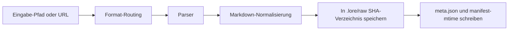

# Unterstützte Formate

Diese Seite ist die Ingest/Export-Kompatibilitätsreferenz für Lore.

## Ingest-Formate

| Format | Parser | Anforderungen | Hinweise |
|---|---|---|---|
| `.md` | Direkt | Keine | Markdown wird durch Normalisierung beibehalten |
| `.txt` | Direkt | Keine | Als Klartext behandelt |
| `.html` / `.htm` | HTML-Parser | Keine | Vor Normalisierung in Markdown konvertiert |
| `.json` / `.jsonl` | JSON-Parser | Keine | Versucht zuerst Konversations-Transkript-Erkennung |
| `.pdf` | Replicate Marker | Replicate-Token | Verwendet Marker-Modell auf Replicate |
| `.docx` / `.pptx` / `.xlsx` / `.epub` | Replicate Marker | Replicate-Token | Als Dokumentformate über Marker geparst |
| Bilder (`.png`, `.jpg`, `.jpeg`, `.webp`, `.gif`, `.bmp`, `.tiff`) | Replicate Vision | Replicate-Token | OCR + beschreibende Extraktion |
| Webseiten-URLs | Cloudflare BR `/markdown` oder Jina | Optionale CF-Anmeldedaten | Cloudflare-Markdown-Endpunkt bei vorhandenen Anmeldedaten; Jina-Fallback |
| Dokument-URLs (`.pdf`, `.docx`, `.pptx`, `.xlsx`, `.epub`) | Temporärer Download → Replicate Marker | Replicate-Token | In temporäres Verzeichnis heruntergeladen und dann wie lokale Dokumente verarbeitet |
| Bild-URLs (`.png`, `.jpg`, `.jpeg`, `.webp`, `.gif`, `.bmp`) | Temporärer Download → Replicate Vision | Replicate-Token | In temporäres Verzeichnis heruntergeladen und dann wie lokale Bilder verarbeitet |
| Video-URLs | `yt-dlp`-Untertitel-Pipeline | `yt-dlp` empfohlen | Fällt auf URL-Parser zurück, wenn Untertitel nicht verfügbar sind |

## Ingest-Pipeline-Überblick



## Sitzungs-Framework-Quellen

Lore kann lokalen Sitzungsverlauf direkt aufnehmen mit:

```bash
lore ingest-sessions [framework|all]
```

| Framework-Schlüssel | Standard-Quell-Orte (OS-abhängig) | Typische Dateitypen |
|---|---|---|
| `claude-code` | `~/.claude/projects/` | `.jsonl` |
| `codex-cli` | `~/.codex/sessions/`, `~/.codex/projects/` | `.jsonl` |
| `copilot-cli` | `~/.copilot/session-state/` (oder `COPILOT_HOME`) | `events.jsonl` |
| `copilot-chat` | VS Code Workspace-Speicher `*/chatSessions/` | `.jsonl`, `.json` |
| `cursor` | Cursor Workspace-Speicher | `.jsonl`, `.json` |
| `gemini-cli` | `~/.gemini/`, `~/.config/gemini/` | `.jsonl`, `.json`, `.md` |
| `obsidian` | `~/Documents/Obsidian Vault/` (oder benutzerdefinierte Roots) | `.md` |

Hinweise:

- Sitzungsimporte laufen durch dieselbe Roh-Ingest-Pipeline und erzeugen `.lore/raw/<sha>/`-Einträge.
- `meta.json` enthält jetzt `session`-Metadaten für framework-aufgenommene Quellen.
- `--dry-run` lässt Sie die Entdeckung inspizieren, bevor Ingest-Ausgaben geschrieben werden.

## Konversations-Export-Unterstützung (`.json` / `.jsonl`)

Lore versucht vor generischer JSON-Renderung eine Schema-Erkennung.

Erkannte Schema-Familien:

- role/content-Nachrichten-Arrays (`user`/`assistant`, einschließlich `human`/`ai`-Rollenversionen)
- ChatGPT-Mapping-Exports (`mapping`-Graph)
- Claude-ähnliche und Codex-ähnliche JSONL-Sitzungsereignisse
- Slack-ähnliche Nachrichten-Arrays

Konversationsausgaben werden als Transkript-Markdown mit zitierten Benutzerzeilen und Assistenten-Antwortblöcken normalisiert.

### Schema-Matrix

| Eingabeform | Erkennungsergebnis | Ausgabe |
|---|---|---|
| Array/Object mit role-content-Nachrichten | Konversations-Transkript | `# Conversation Transcript` Markdown |
| ChatGPT-Mapping-Objekt | Konversations-Transkript | Geordnete user/assistant-Züge |
| JSONL-Sitzungsereignisse | Konversations-Transkript | Geordnete Züge aus Ereignis-Nutzlasten |
| Slack-Nachrichten-Arrays | Konversations-Transkript | Heuristisches alternierendes Rollen-Mapping |
| Kein erkanntes Schema | Generische JSON-Renderung | Überschrift/Wert-Markdown-Umwandlung |

Wenn eine Datei nicht auf bekannte Konversationsmuster passt, fällt Lore auf generische JSON-zu-Markdown-Umwandlung zurück.

## URL- und Video-Verhalten

### URL-Inhalt

Lore routet URL-Aufnahme basierend auf der Dateierweiterung im URL-Pfad:

- **Dokument-Erweiterungen** (`.pdf`, `.docx`, `.pptx`, `.xlsx`, `.epub`): in temporäre Datei heruntergeladen und dann über Replicate Marker verarbeitet — identisch mit lokaler Dokumentaufnahme. Erfordert `TELEPAT_REPLICATE_TOKEN`.
- **Bild-Erweiterungen** (`.png`, `.jpg`, `.jpeg`, `.webp`, `.gif`, `.bmp`): in temporäre Datei heruntergeladen und dann über Replicate Vision verarbeitet — identisch mit lokaler Bildaufnahme. Erfordert `TELEPAT_REPLICATE_TOKEN`.
- **Alle anderen URLs** (Webseiten, HTML usw.):
  - Wenn beide `LORE_CF_ACCOUNT_ID` und `LORE_CF_TOKEN` gesetzt sind, ruft Lore den Cloudflare Browser Run `/markdown`-Endpunkt auf, der Markdown direkt ohne lokale HTML-Konvertierung zurückgibt.
  - Bei Cloudflare-Fehler oder nicht-string-Antwort protokolliert Lore den Fallback und verwendet Jina.
  - Ohne Cloudflare-Anmeldedaten ruft Lore direkt über Jina ab.

### Video-URLs

- Lore prüft auf `yt-dlp`
- Wenn Untertitel verfügbar sind, nimmt Lore bereinigten Transkripttext auf
- Wenn `yt-dlp` fehlt oder Untertitel nicht verfügbar/leer sind, fällt Lore auf URL-Parsing zurück

Extraktor-Metadaten werden in `meta.json` für Video-Aufnahmen gespeichert.

## Roh-Metadaten-Hinweise

- alle Ingests erstellen `.lore/raw/<sha256>/meta.json`
- lokale Datei-Ingests können ordnerabgeleitete Tags ableiten
- extrahierter Text kann heuristische Speicher-Tags anhängen (`decision`, `preference`, `problem`, `milestone`, `emotional`)
- Duplikat-Ingests wiederverwendet vorhandene Roh-Einträge

## Export-Formate

Lore unterstützt diese Exportziele:

- `bundle`
- `slides`
- `pdf`
- `docx`
- `web`
- `canvas`
- `graphml`

Siehe [Exportieren](../guides/exporting.md) für detaillierte Anwendungsfälle und Ausgabebeispiele.

## Praktische Beispiele

```bash
# gemischten Ordner aufnehmen
lore ingest ./docs/architecture.md
lore ingest ./notes/session.jsonl
lore ingest ./assets/diagram.png

# eine URL und eine Video-URL aufnehmen
lore ingest https://example.com/post
lore ingest https://www.youtube.com/watch?v=<id>
```
