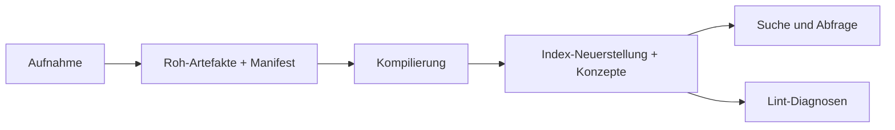
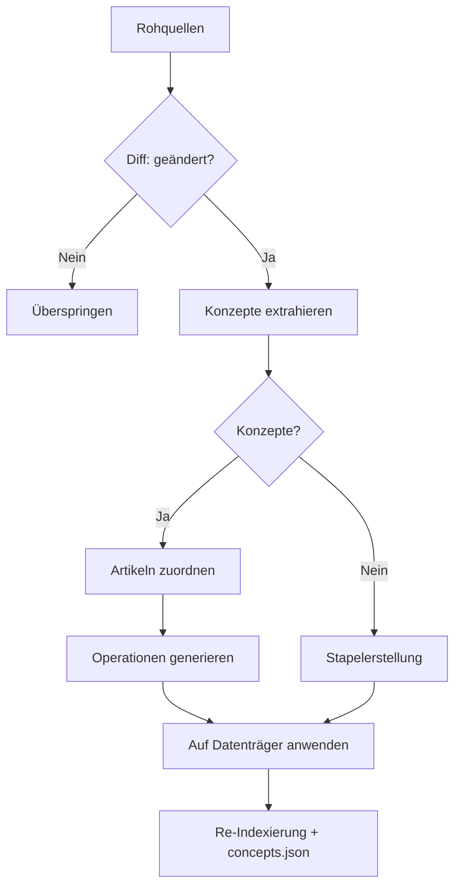

# Architektur

Lore kombiniert markdown-primäre Wissensspeicherung mit einer Operations-Pipeline für Aufnahme, Kompilierung, Retrieval und Qualitätsdurchsetzung.

## 4-Schicht-Wiki

1. **Index** (`wiki/index.md`) — wird zuerst konsultiert
2. **Artikel** (`wiki/articles/*.md`) — Konzeptartikel mit Backlinks und Herkunft
3. **Abgeleitet** (`wiki/derived/`) — Q&A-Antworten, Folien, Diagramme
4. **Assets** (`wiki/assets/`) — lokale Bilder

Unterstützter Zustand lebt in `.lore/`:

- `raw/` normalisierte Ingest-Artefakte, Schlüssel nach Inhaltshash
- `manifest.json` Quelle-zu-Roh-Verfolgung, Kompilierungszeitstempel, extrahierte Hashes
- `wiki/concepts.json` normalisierte Konzeptmetadaten, die nach Kompilierung generiert werden
- `wiki/concepts/` konzeptdetaillierte Seiten (optional)
- `wiki/deprecated/` soft-gelöschte Artikel, die für Audit aufbewahrt werden
- `db.sqlite` FTS/Backlink-Datenbank
- `compile.lock` aktive Kompilierungs-Mutex-Datei

## Repository-Layout-Übersicht

| Pfad | Zweck |
|---|---|
| `.lore/raw/` | Quell-abgeleitete extrahierte Artefakte, Schlüssel nach Hash |
| `.lore/wiki/articles/` | Kompilierte Konzeptseiten mit Herkunft |
| `.lore/wiki/deprecated/` | Soft-gelöschte Artikel (Audit-Trail) |
| `.lore/wiki/index.md` | Kanonischer Themenindex |
| `.lore/wiki/concepts.json` | Konzeptindex mit Aliassen/Tags/Konfidenz |
| `.lore/wiki/derived/qa/` | Abgelegte Abfrage-Antworten |
| `.lore/db.sqlite` | FTS- und Link-Graph-Tabellen |
| `.lore/logs/` | JSONL-Befehls-Ausführungslogs |

## 4-Phasen-Pipeline

1. **Aufnahme** — `raw/` wird mit `extracted.md` + `meta.json` befüllt
2. **Kompilierung** — 6-Stufen-Pipeline: Diff → Konzepte extrahieren → Zuordnen → Ops generieren → Anwenden → Neu indexieren
3. **Abfrage** — Q&A über BFS/DFS-Traversierung, abgelegt nach `derived/qa/`
4. **Lint** — Waisen, Lücken, mehrdeutige Behauptungen und zeilenbewusste Diagnosen werden offengelegt

Operativ sind diese Phasen idempotent und können inkrementell erneut ausgeführt werden.

Compile ist standardmäßig hash-inkrementell: unveränderte extrahierte Inhalte werden basierend auf `manifest.json` `extractedHash`-Feldern übersprungen.

### Pipeline-Diagramm



### Compile-Unterpipeline



## Herkunftsmodell

Jeder Artikel verfolgt, welche Quellen zu welchen Zeilen beigetragen haben. Zwei Mechanismen:

### Inline-Herkunft

Zeilen tragen `<!-- sources:HASH(CONFIDENCE) -->`-Kommentare:

```markdown
The auth service uses JWT. <!-- sources:abc123(extracted) def456(inferred) -->
```

Wenn das LLM Artikel für Zuordnung liest, werden Herkunftskommentare entfernt. Das LLM sieht saubere, nummerierte Zeilen.

### Kumulative Referenzen

Jeder Artikel endet mit einem `## References`-Abschnitt, der alle jemals zusammengeführten Quellen-Hashes auflistet:

```markdown
## References
- abc123 (extracted)
- def456 (inferred)
```

Dieser Abschnitt wird vom System verwaltet und aus dem LLM-Kontext ausgeblendet.

### Verwandter Abschnitt

`## Related` wird automatisch aus `[[wiki-links]]` generiert, die im Artikelkörper gefunden werden.

## Operationsmodell

Das LLM gibt zeilenweise Operationen (JSON) aus. Jede Operation trägt ein `sources`-Array zur Herkunft:

| Operation | Wirkung |
|---|---|
| `replace` | Eine Zeile ersetzen |
| `insert-after` | Nach einer Zielzeile einfügen |
| `delete-range` | Zeilen entfernen (validiert: start ≤ end) |
| `replace-range` | Einen Zeilenbereich ersetzen |
| `split` | Artikel in zwei aufteilen |
| `append-source` | Quellen zu vorhandenen Zeilen hinzufügen (keine Inhaltsänderung) |
| `soft-delete` | Artikel in veraltet verschieben |

Operationen werden sequenziell pro Quelle angewendet. Zeilenreferenzen verwenden `¶` (Pilcrow)-Präfixe, um sie von YAML-Zeilennummern zu unterscheiden.

## Compile-Zuverlässigkeitskontrollen

| Kontrolle | Zweck |
|---|---|
| PID-Lock-Datei (`compile.lock`) | Überlappende Kompilierungsläufe verhindern |
| Hash-basiertes Überspringen | Vermeidet Neu-kompilieren unveränderter extrahierter Inhalte |
| Pro-Quelle-Wiederholung (1 Versuch) | Erholung von fehlerhafter LLM-Ausgabe |
| Null-Konzept-Überspringen | Quellen ohne extrahierbare Konzepte gehen zur Stapelerstellung |
| `start > end`-Validierung | Bereichsoperationen verwerfen ungültige Bereiche |
| Nach-Compile-Index-Neuerstellung | Hält FTS/Graph-Zustand mit Artikelsatz synchron |

## Ingest- und Metadaten-Flow

Ingest schreibt `.lore/raw/<sha>/extracted.md` und `.lore/raw/<sha>/meta.json`.

Metadaten können enthalten:

- kanonische Quellenidentität
- ordnerabgeleitete Themen-Tags
- heuristische Speichertyp-Tags
- Zeitstempel und Herkunftsfelder

Duplikat-Inhalt wird per Hash erkannt und wiederverwendet vorhandene Roh-Einträge.

Metadaten-Tags können von Pfad-Hinweisen und Speichermuster-Heuristiken stammen, um nachgelagerte Klassifizierung und Entdeckung zu verbessern.

## Abfrage-Flow und Normalisierung

`query` verwendet hybrides Retrieval aus FTS + Graph-Kontext.

Frage-Text-Normalisierung ist optional und wird gesteuert durch:

- CLI-Flags: `--normalize-question`, `--no-normalize-question`
- ENV-Standard: `LORE_QUERY_NORMALIZE`

Normalisierung ist bewusst konservativ, um technische Token nicht zu verändern.

Retrieval-Sequenz:

1. Index-Kontext laden
2. FTS-Kandidatenausführung starten
3. One-Hop-Nachbarn über Link-Graph erweitern
4. Antwort über LLM synthetisieren

## Graph- und Suchspeicher

SQLite-Strukturen:

- `fts`: Volltextindex (`slug`, `title`, `body`) mit Ranking/Snippets
- `links`: konzeptuelle Kanten (`from_slug`, `to_slug`)

`lore path` berechnet kürzeste konzeptuelle Pfade über BFS über ungerichtete Adjazanz, die aus `links` abgeleitet ist.

## Index-Integrität und Schutzmaßnahmen

Index-Neuerstellung kann im Standard- oder Reparaturmodus laufen:

- Standard: DB-Artefakte aus Manifest/Roh-Zustand neu generieren
- Reparatur: fehlende Manifest-Einträge aus vorhandenen Roh-Ordnern wiederherstellen

Backlink-Indexierung filtert Link-Ziele mit geringem Signal (z.B. nur-Stoppwort-Links) um Graph-Rauschen zu reduzieren.

Herkunftskommentare werden aus Artikelelementen vor FTS-Indexierung entfernt, damit sie Suchergebnisse nicht verschmutzen.

Schutzmaßnahmen-Vorteile:

- weniger rauschhafte Kanten im Konzept-Graphen
- sauberere Lint-Lücken/Waisen-Signale
- stabilere Pfad- und Nachbarschaftserkundung

## MCP-Wartungsoberfläche

Der MCP-Server stellt Wartungs- und Diagnosetools für Automatisierungsloops bereit, einschließlich:

- Duplikatprüfungen vor Aufnahme
- Roh-Tag-Verteilungszusammenfassungen
- Waisen/Lücken/Mehrdeutigkeit-Lint-Zusammenfassungen
- Index-Neuerstellungs- und Reparaturauslöser

## SQLite-Schema

- `fts` — FTS5-Virtuelle Tabelle (slug, title, body) mit Porter-Stemming
- `links` — Backlink-Graph (from_slug, to_slug)

## Verwandte Dokumente

- [Ingest-Pipeline](./ingest-pipeline.md)
- [LLM-Pipeline](./llm-pipeline.md)
- [Ausführungs-Logging](./logging.md)
- [Ihr Wiki kompilieren](../guides/compiling-your-wiki.md)
