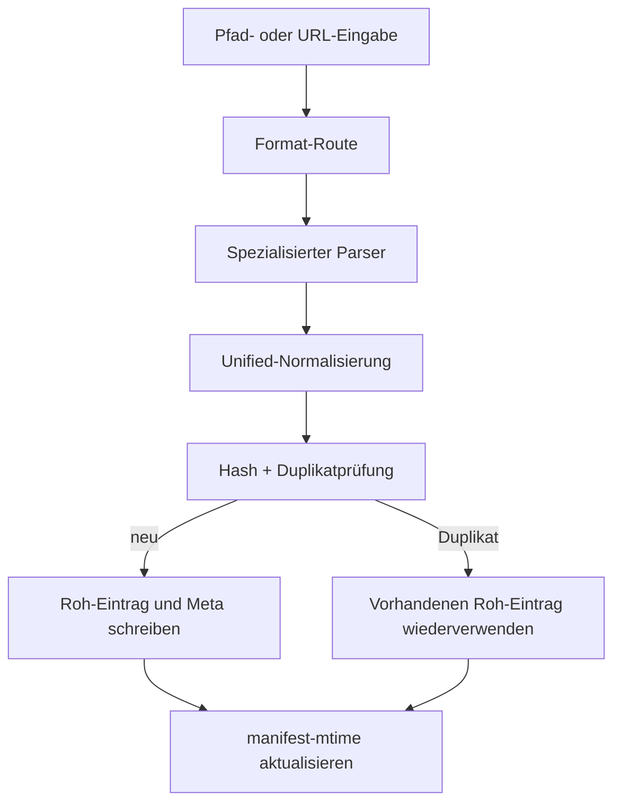

# Ingest-Pipeline

Zwei Stufen: **Formatextrahierung** dann **Unified.js-Normalisierung**.

Jede erfolgreiche Aufnahme erstellt einen deterministischen Roh-Eintrag in `.lore/raw/<sha256>/`.

## Stufe 1: Formatextrahierung

Routet zum richtigen Parser basierend auf Dateityp oder URL-Muster.

### Routing-Matrix

| Eingabetyp | Parser-Pfad | Hinweise |
|---|---|---|
| Markdown/Text | direkte Textextraktion | normalisiert von unified-Pipeline |
| HTML | HTML-Parser | in Markdown konvertiert |
| JSON/JSONL | Konversationserkennung + JSON-Renderung Fallback | Transkript-erste-Strategie |
| PDF/DOCX/PPTX/XLSX/EPUB | Replicate Marker | erfordert Replicate-Token |
| Bildformate | Replicate Vision | OCR/Bildunterschrift-Prompt-Extraktion |
| Webseiten-URL | Cloudflare BR `/markdown`-Endpunkt bei Konfiguration, sonst Jina | gibt Markdown direkt zurück; Cloudflare-Fehler fällt auf Jina zurück |
| Dokument-URL (`.pdf`, `.docx` usw.) | temporärer Download → Replicate Marker | identischer Pfad wie lokale Dokumentdateien |
| Bild-URL (`.png`, `.jpg` usw.) | temporärer Download → Replicate Vision | identischer Pfad wie lokale Bilddateien |
| Video-URL | `yt-dlp`-Untertitel-Workflow | fällt auf URL-Parsing zurück, wenn nicht verfügbar |

### Parser-Auswahl

- Markdown und textähnliche Dateien werden durch direkte Markdown-Normalisierung geroutet.
- Office/PDF/Medienformate werden durch spezialisierte Extraktoren geroutet.
- `.json` / `.jsonl`-Inhalt wird zuerst auf Konversations-Exports schema-geprüft.
- URLs mit Dokument- oder Bild-Erweiterungen werden in eine temporäre Datei heruntergeladen und durch denselben lokalen Extraktor (Marker oder Vision) geroutet.
- Alle anderen URLs werden basierend auf Quelle und Konfiguration durch Fetch/Browser-Extraktion geroutet.

### Video-URL-Fallback-Verhalten

1. `yt-dlp`-Verfügbarkeit prüfen
2. Untertitel-Download und Bereinigung versuchen
3. bei fehlenden/leeren Untertiteln URL-Parsing-Fallback verwenden

Extraktor-Herkunft wird in Roh-Metadaten (`meta.json`) geschrieben.

### Konversations-Schema-Erkennung

Für JSON-Eingaben versucht Lore vor generischer Renderung eine strukturierte Konversations-Extraktion. Unterstützte Familien umfassen:

- role/content-Arrays
- ChatGPT-Mapping-Bäume
- Codex/Claude-ähnliche JSONL-Sitzungen
- Slack-ähnliche Nachrichten-Arrays

Wenn die Erkennung fehlschlägt, fällt Lore auf generische JSON-Markdown-Ausgabe zurück.

### Konversations-Normalisierungsergebnis

Erkannte Konversations-Schemata werden als Transkript-Markdown unter einer Standardüberschrift (`# Conversation Transcript`) mit zitierten Benutzerzügen und als Fließtext beibehaltenen Assistentenzügen ausgegeben.

## Stufe 2: Unified.js-Normalisierung

1. In mdast-AST parsen (remark-parse)
2. YAML-Frontmatter extrahieren, `[[wiki-links]]` auflösen
3. Überschriftshierarchie normalisieren, Whitespace deduplizieren
4. Zu `extracted.md` stringifizieren

Normalisierungsziel: stabiles Markdown für deterministisches Hashing und sauberere Compile-Eingaben.

## Roh-Eintrag-Layout

Jedes Rohverzeichnis enthält:

- `source`-Kopie (wenn verfügbar)
- `extracted.md` normalisiertes Markdown
- `meta.json` Ingest-Metadaten

Typisches `meta.json` enthält:

- Inhaltshash und Format
- Quellpfad oder URL-Herkunft
- Extraktionsdatum/-uhrzeit
- abgeleitete Themen- und Speicher-Tags
- optionale Extraktor-Kennung (Video-Aufnahme)

`meta.json` enthält Zeit-/Herkunftsfelder und Tags, die stammen können aus:

- Quell-Frontmatter-Tags
- Pfad-abgeleitete Themen-Tags
- Heuristische Speichersignale (`decision`, `preference`, `problem`, `milestone`, `emotional`)

## Duplikaterkennung

Ingest berechnet einen Quellen-Hash und umgeht, wenn der genaue Inhalt bereits aufgenommen wurde.

- es wird kein dupliziertes Rohverzeichnis erstellt
- vorhandener Roh-Eintrag wird wiederverwendet
- Ingest-Ergebnis enthält `duplicate=true`

Dies hält `raw/` stabil und verhindert duplizierten Artikelchurn downstream.

## Ingest-Flow-Diagramm

## Operationelle Schutzmaßnahmen

| Schutzmaßnahme | Vorteil |
|---|---|
| deterministische Hash-Identität | Duplikatverhinderung und stabile Manifest-Verfolgung |
| Parser-Fallback-Ketten | widerstandsfähige Aufnahme in teilweise konfigurierten Umgebungen |
| Metadatenanreicherung | bessere nachgelagerte Indexierungs- und Wartungsworkflows |

## Fehlerbehebungssignale

| Symptom | Wahrscheinliche Ursache | Lösung |
|---|---|---|
| JSON-Datei nicht als Transkript behandelt | Schema nicht erkannt | Struktur inspizieren oder auf generisches JSON-Markdown-Fallback vertrauen |
| Video-Aufnahme hat kein Transkript | `yt-dlp` nicht verfügbar oder keine Untertitel | `yt-dlp` installieren oder URL-Fallback-Ausgabe akzeptieren |
| URL-Extraktionsqualität低 | Rendering-Komplexität der Quelle | Cloudflare BR konfigurieren oder eine lokal exportierte Kopie aufnehmen |

## Interaktion mit Indexierung

`compile` und explizite `index`-Operationen verbrauchen `meta.json` + `extracted.md` aus `raw/`.

Wenn ältere Manifeste auf fehlende Rohverzeichnisse verweisen,重建t der Index-Reparaturmodus (`lore index --repair`) fehlende Manifest-Einträge durch Scannen vorhandener Roh-Ordner.

## Verwandte Dokumente

- [Unterstützte Formate](../reference/supported-formats.md)
- [Ihr Wiki kompilieren](../guides/compiling-your-wiki.md)
- [Fehlerbehebung](../guides/troubleshooting.md)
