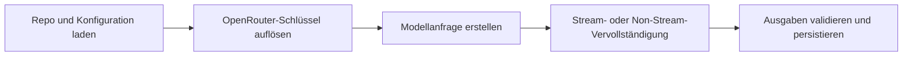

# LLM-Pipeline

Lore verwendet LLM-Aufrufe in fünf primären Operationen, von denen drei die Kompilierungspipeline bilden:

1. **Konzeptextrahierung** — extrahiert benannte Konzepte mit Beschreibungen und Konfidenz aus rohem Quelleninhalt
2. **Artikelzuordnung** — ordnet die Konzepte einer Quelle bestehenden Wiki-Artikeln zu
3. **Operationserstellung** — erzeugt zeilenweise Operationen, die beschreiben, wie zugeordnete Artikel bearbeitet werden
4. **Stapelerstellung** — generiert neue Artikel für nicht zugeordnete Quellen
5. **Q&A (`query`)** — lädt zuerst `index.md`, dann relevante Artikel über FTS + Graph-Nachbarschaftserweiterung; beantwortet optional die Frage; legt optional das Ergebnis zurück
6. **Explain** — tiefgehende Konzept-Synthese aus einem zugeordneten Artikel plus Graph-Nachbarn

Die ersten vier bilden die Kompilierungspipeline (→ Konzeptextrahierung → Zuordnung → Operationen → Erstellungen). Alle LLM-Aufrufe laufen über OpenRouter via dem `openai` npm-SDK.

`lint` und `index` sind keine LLM-Operationen; sie arbeiten mit lokalem Markdown und SQLite-Zustand.

## End-to-End-LLM-Flow



## Compile-LLM-Stufen

### 1. Konzeptextrahierung

Jede geänderte Quelle wird an das LLM mit Anweisungen zur Konzeptextrahierung gesendet. Das LLM gibt ein JSON-Array zurück:

```json
[
  {
    "name": "Authentication",
    "description": "User authentication via JWT tokens and OAuth2 providers.",
    "confidence": "extracted",
    "for_source": "source_1"
  }
]
```

- **Stapel**: Alle geänderten Quellen werden in einem einzelnen Aufruf gesendet.
- **Konfidenz**: LLM entscheidet pro Konzept (`extracted`, `inferred`, `ambiguous`).
- **`for_source`**: Verweist auf den Quellenindex im Stapel (1-basiert).
- **Null Konzepte**: Quellen ohne extrahierbare Konzepte gehen zur Stapelerstellung ohne Zuordnung.

### 2. Artikelzuordnung

Jede Quelle mit Konzepten wird mit dem vorhandenen Artikelsatz abgeglichen. Das LLM erhält:

- Quellentitel, Inhalt und Konzepte
- Liste von Kandidatenartikel-Slugs (bis zu 30 bei FTS-Vorfilterung oder vollständige Liste für kleine Wikis)
- Artikelelemente mit Zeilennummern und entfernter Herkunft

Das LLM gibt die Slugs zugeordneter Artikel zurück (bis zu 3 pro Quelle) oder eine leere Liste bei keiner Übereinstimmung.

**Vorfilterung**: Für Wikis mit 200+ Artikeln schränkt eine FTS-Suche nach Konzeptnamen die Kandidaten auf 30 ein. Für kleinere Wikis sind alle Artikel Kandidaten.

### 3. Operationserstellung

Für jede zugeordnete Quelle generiert das LLM ein JSON-Array von Operationen:

```json
[
  {
    "op": "replace",
    "line": "¶2",
    "content": "Updated line content.",
    "sources": ["sha256(extracted)"],
    "confidence": "extracted"
  },
  {
    "op": "insert-after",
    "line": "¶5",
    "content": "New derived insight.",
    "sources": ["sha256(inferred)"],
    "confidence": "inferred"
  }
]
```

Das LLM sieht zugeordnete Artikel mit:
- Zeilennummern präfigiert mit `¶` (Pilcrow)
- entfernten Herkunftskommentaren
- ausgeblendeten `## References` und `## Related`-Abschnitten

**Konfidenz pro Operation**: Für Bearbeitungen vorhandener Artikel setzt das LLM `confidence` pro Operation (Standard: `inferred`). Für neue Artikel, die per Stapelerstellung erstellt wurden, ist der Standard aller Zeilen `extracted`.

### 4. Stapelerstellung

Nicht zugeordnete Quellen (und Quellen mit null Konzepten) werden gestapelt. Das LLM generiert einen Satz von Erstellungsoperationen:

```json
[
  {
    "op": "create",
    "slug": "jwt-authentication",
    "title": "JWT Authentication",
    "description": "How the system uses JWT tokens...",
    "lines": [
      { "content": "Line 1 content.", "sources": ["sha256(extracted)"] }
    ],
    "sources": ["sha256"],
    "confidence": "extracted"
  }
]
```

Neue Artikel werden mit Herkunftskommentaren und befüllten `## References` geschrieben.

## Compile-Abbruch und Fehlerbehandlung

Compile validiert LLM-Ausgabe vor dem Schreiben von Dateien. Antworten werden einmal wiederholt, wenn:

- Der Anbieter Abbruch meldet (`finish_reason=length`)
- JSON-Ausgabe nicht parstbar ist
- Operationen strukturell ungültig sind

Bei wiederholbarem Fehler wiederholt Compile einmal. Wenn die Wiederholung ebenfalls fehlschlägt, wird die Quelle übersprungen (protokolliert) und Compile fährt mit verbleibenden Quellen fort. Die Kompilierung bricht nicht bei individuellen Quellenfehlern ab.

## maxTokens-Semantik

- `maxTokens` ist optional in `.lore/config.json`.
- Wenn gesetzt, fügt Lore `max_tokens` in OpenRouter-Anfragen hinzu.
- Wenn nicht gesetzt, lässt Lore `max_tokens` weg und verwendet Anbieter/Modell-Standardwerte.

## Retrieval-seitiges Prompting

### Query

- Kontextzusammensetzung: Index + ausgewählte Artikelelemente
- Quellenverfolgung: zurückgegebene Slugs und optional abgelegte QA-Markdown
- optionale Normalisierung: konservative Abfrage-Bereinigung via Flag oder ENV-Standard

### Explain

- zuerst exakte Slug-Nachschlage, dann FTS-Fallback
- Nachbarschaftserweiterung zur Anreicherung des Kontextfensters
- Langform-Synthese mit Wiki-Stil-Referenzen

## Laufzeitkontrollen

| Kontrolle | Wirkung |
|---|---|
| `temperature` | Ausgabe-Vielfalt und Determinismus-Tradeoff |
| `maxTokens` | Antwortlängendecke bei Konfiguration |
| `LORE_QUERY_NORMALIZE` | Standard-Abfrage-Normalisierungsschalter |

## Fehlermodi und Wiederherstellung

| Symptom | Wahrscheinliche Ursache | Wiederherstellung |
|---|---|---|
| Compile wiederholt häufig | fehlerhafte LLM-Ausgabe oder Token-Limits | Wiederholung zulassen; Modell/maxTokens bei andauerndem Problem abstimmen |
| Query-Ergebnis低信号 | schwacher/limitierter Retrieval-Kontext | Index-Reparatur ausführen, Links verbessern, erneut versuchen |
| Explain verpasst Konzept | kein exakter/FTS-Match | neu kompilieren und klareren Konzeptnamen verwenden |
| Quellen erhalten konsequent null Konzepte | Inhalt zu abstrakt oder kurz für Konzeptextrahierung | Roh-Inhalt überprüfen; möglicherweise manuelle Kuratierung erforderlich |
| Operationen schlagen Validierung fehl | LLM erzeugte ungültige Zeilenreferenzen | Compile überspringt Quelle und fährt fort; Roh-Inhalt überprüfen |

## Ausführungs-Logging

- Compile- und Query-Ausführungen erzeugen strukturierte JSONL-Ereignisse in `.lore/logs/<runId>.jsonl`.
- Token-Stream-Ereignisse werden mit rohem Token-Text protokolliert.
- Befehls-stderr zeigt knappe Ausführungs-Start/Ende-Zusammenfassungen mit Ausführungs-ID und Log-Pfad.

## Verwandte Dokumente

- [LLM-Modelle](../reference/llm-models.md)
- [Konfiguration](../guides/configuration.md)
- [Ihr Wiki kompilieren](../guides/compiling-your-wiki.md)
- [Suchen und Abfragen](../guides/searching-and-querying.md)
- [Architektur](./architecture.md)
