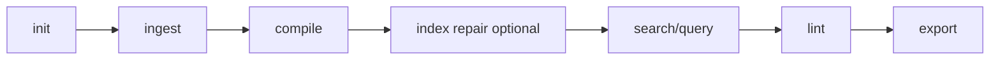

# 快速开始

本快速开始指南将引导你完成完整的 Lore 生命周期：初始化、摄入、编译、检索、验证和导出。

## 1) 初始化

```bash
lore init
```

预期结果：创建 `.lore/` 目录，包含基础配置和存储布局。

## 2) 摄入内容

```bash
# 本地文件
lore ingest ./README.md

# URL
lore ingest https://example.com/article
```

预期结果：新的 `.lore/raw/<sha256>/` 条目，包含 `extracted.md` 和 `meta.json`。

## 3) 编译为 Wiki 文章

```bash
lore compile
```

预期结果：`.lore/wiki/articles/*.md`、更新的 `.lore/wiki/index.md`、刷新的搜索/链接索引。文章包含内联来源标记，跟踪哪些源贡献了每一行。

从旧版 Lore 升级后，运行 `lore compile --concepts-only` 为现有文章回填来源。

## 4) 搜索和提问

```bash
# 词汇发现
lore search "concept"

# 图 + LLM 答案
lore query "What is the architecture?"
```

## 5) 验证图健康状态

```bash
lore lint --json
```

使用代码检查输出识别间隙、孤立和歧义文章。

## 6) 导出产物

```bash
lore export bundle
```

默认输出位置：`.lore/exports`。

## 可选：摄入后自动编译

```bash
# 启用自动编译 — 摄入自动运行编译
lore settings set autoCompile true --scope repo
```

启用后，`lore ingest` 和 `lore ingest-sessions` 在摄入完成后自动运行 `lore compile`。使用 `lore settings set autoCompile false --scope repo` 禁用。

## 可选：修复优先索引

```bash
# 在部分复制/中断操作后有用
lore index --repair
```

## 端到端脚本

```bash
lore init
lore ingest ./README.md
lore ingest https://example.com/article
lore compile
lore index --repair
lore lint --json
lore query "What changed in architecture?"
lore export bundle
```

## 快速开始流程



## 下一步

- [编译你的 Wiki](../guides/compiling-your-wiki.md)
- [故障排除](../guides/troubleshooting.md)
- [代码检查与健康状态](../guides/linting-and-health.md)
- [导出](../guides/exporting.md)
- [CLI 参考](../reference/cli-reference.md)