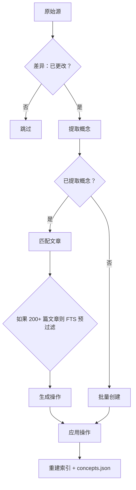

# 编译你的 Wiki

```bash
lore compile [--force] [--concepts-only]
```

编译将原始提取的文档转换为结构化的 Wiki 文章，包含 `[[wiki-links]]`、YAML frontmatter、置信度标签和段落级来源跟踪。

## 编译管道（6 步）

每次 `lore compile` 运行执行六步管道：

1. **差异** -- 比较 `manifest.json` 中的 `extractedHash` 与原始内容。只有更改的源继续。`--force` 绕过此检查。
2. **提取概念** -- LLM 从每个更改的源中提取命名概念，包含描述和置信度。
3. **匹配** -- 每个源的概念与现有 Wiki 文章匹配。没有概念的源跳转到批量创建。对于包含 200+ 篇文章的 Wiki，FTS 预过滤候选列表。
4. **生成操作** -- 对于每个匹配的源，LLM 输出一系列行级操作，描述如何编辑匹配的文章。
5. **应用操作** -- 操作应用到磁盘：文章就地修改，新文章创建，已弃用的文章软删除到 `.lore/wiki/deprecated/`。
6. **重建索引** -- 重建 FTS 索引、反向链接图和 `concepts.json` 以反映更新的文章集。



## 来源跟踪

Lore 跟踪哪些源贡献了每篇文章的每一行。两种机制协同工作：

### 内联来源

每行可能携带内联 HTML 注释，记录源哈希和置信度：

```markdown
The authentication service uses JWT tokens. <!-- sources:abc123(extracted) def456(inferred) -->
```

格式为 `<!-- sources:HASH(CONFIDENCE) ... -->`。置信度标签是按操作的：

| 标签 | 含义 |
|---|---|
| `extracted` | 直接在源文档中陈述 |
| `inferred` | 合理的 LLM 推断 |

当 LLM 读取文章内容进行匹配和操作生成时，内联来源注释会被剥离。LLM 看到干净的编号行，没有源注释。

### 累积引用

每篇文章末尾都有一个 `## References` 部分，列出所有曾经合并到该文章的源哈希：

```markdown
## References
- abc123 (extracted)
- def456 (inferred)
- ghi789 (extracted)
```

此部分由系统自动管理。当 LLM 生成操作时，`## References` 和 `## Related` 部分在其上下文窗口中被隐藏。

### 相关部分

系统从文章主体中找到的 `[[wiki-links]]` 自动生成 `## Related` 部分。链接去重并排序。

## 操作模型

LLM 输出行级操作的 JSON 数组。每个操作针对匹配文章中的特定行，并包含 `sources` 字段用于来源跟踪。

| 操作 | 描述 |
|---|---|
| `replace` | 替换单行内容 |
| `insert-after` | 在目标行后插入新行 |
| `delete-range` | 删除范围行（起始到结束，包含） |
| `replace-range` | 用新内容替换范围行 |
| `split` | 将文章拆分为两部分：保留部分在当前 slug，移动其余部分到新 slug |
| `append-source` | 向现有行添加源哈希而不更改内容（仅更新置信度） |
| `soft-delete` | 将文章标记为已弃用（从其 slug 重命名） |

### 操作格式

```json
[
  {
    "op": "replace",
    "line": "¶2",
    "content": "Updated content for line 2.",
    "sources": ["abc123(extracted)"],
    "confidence": "extracted"
  },
  {
    "op": "insert-after",
    "line": "¶3",
    "content": "New insight from source.",
    "sources": ["abc123(extracted)"],
    "confidence": "extracted"
  },
  {
    "op": "delete-range",
    "start": "¶5",
    "end": "¶7"
  }
]
```

行引用使用 `¶`（段落符号）以区别于 YAML frontmatter 行号。LLM 在上下文中看到带有段落前缀行号的文章。

### 多文章编辑

单个源可以生成针对多个现有文章的操作。系统按源顺序应用操作，在每次源编辑后刷新文章列表以处理拆分和新文章。

### 软删除

当文章不再相关时，LLM 输出 `soft-delete` 操作。文章重命名为 `.lore/wiki/deprecated/` 下的 `.deprecated-{slug}-{timestamp}.md` 路径。它从搜索和链接图中消失，但文件保留用于审计。

## 基于哈希的增量编译

Lore 在 `.lore/manifest.json` 中跟踪每个原始条目的 `extractedHash`。

- 默认行为：仅编译提取内容已更改的条目。
- 升级后首次运行：之前编译的条目如果没有 `extractedHash` 会重新编译一次，然后升级。
- `--force`：绕过哈希检查并重新编译所有有效的原始条目。

## 仅概念模式

```bash
lore compile --concepts-only
```

为在引入来源跟踪之前编译的文章回填来源。它：

1. 读取 `.lore/wiki/articles/` 下的每篇文章。
2. 对于没有内联 `<!-- sources:` 注释的文章，应用回退逻辑（整个主体标记为通用源哈希）。
3. 重建 `concepts.json` 和搜索索引。

在从旧版 Lore 升级后使用一次。它不会重新编译或更改文章内容，只是添加来源标记。

## 批量重试行为

编译按顺序处理源（匹配）和按批处理（创建）。如果响应可重试（输出截断、无效 JSON、无法解析的操作），Lore 重试一次。

| 条件 | 行为 |
|---|---|
| LLM 响应截断 | 重试一次 |
| 无效 JSON 操作输出 | 重试一次 |
| 重试仍然失败 | 跳过源，记录错误，继续编译 |

编译不会在单个源失败时中止。无效操作被记录，受影响的源被跳过。

## 编译锁和并发

Lore 使用 `.lore/compile.lock` 保护编译以防止重叠运行。

- 如果另一个实时编译处于活动状态，`lore compile` 会快速失败并提供可操作的错误。
- 过期或格式错误的锁有效负载会自动回收。
- 当仓库配置中启用 `autoCompile` 时，摄入命令自动触发编译并遵守相同的锁。

锁文件存储进程 ID（PID）。如果该 PID 不再存活，Lore 会删除过期锁并重试获取。

## 索引重建和修复

编译后，保持搜索和图状态最新：

```bash
lore index
```

如果原始条目存在但 `manifest.json` 漂移（例如在部分复制或中断运行后）：

```bash
lore index --repair
```

`--repair` 在索引重建前从 `.lore/raw/` 重建缺失的清单条目。

## 概念元数据输出

成功编译和索引重建后，Lore 写入 `.lore/wiki/concepts.json`：

- `updatedAt` -- 时间戳
- `concepts[]` 条目，包含 `slug`、`canonical`、`title`、`aliases`、`tags`、`confidence`

别名生成是确定性的，包括 slug 别名、连词交换变体（`A and B` → `B and A`）和 3+ 个单词标题的首字母缩略词。

## 图防护栏

在索引重建期间，Lore 过滤低信号链接目标（例如 `[[it]]`、`[[the]]`）以避免嘈杂的图边。

- 好处：更好的 `lore path`、更干净的邻居集、更高信号的代码检查输出。
- 权衡：除非映射到有意义的概念标记，否则故意通用的链接会被丢弃。

## 建议的编译工作流

```bash
# 摄入和编译
lore ingest ./docs
lore compile

# 刷新索引和图
lore index --repair

# 检查图健康状态
lore lint
```

从旧版本升级后：

```bash
# 为现有文章回填来源
lore compile --concepts-only
```

## 自动编译设置

在仓库配置中设置 `autoCompile`，在每次摄入后自动编译：

```bash
lore settings set autoCompile true --scope repo
```

启用后：

- `lore ingest` 在摄入后自动运行编译
- `lore ingest-sessions` 在所有会话摄入后运行一次编译
- MCP `ingest` 工具在设置开启时也会自动编译
- 编译锁防止重叠运行——正在进行的编译会阻止新的编译
- 使用 `lore settings set autoCompile false --scope repo` 禁用

## 编译运行故障排除

| 症状 | 可能原因 | 修复方法 |
|---|---|---|
| 频繁重试 | LLM 输出格式错误或上下文过大 | 允许重试完成；如果持续则调整 model/maxTokens |
| 自动化中的锁错误 | 另一个编译进程处于活动状态 | 序列化编译作业并稍后重试 |
| 未写入新文章 | 增量哈希跳过未更改条目 | 使用 `lore compile --force` |
| 失败后索引似乎过期 | 编译在索引重建前中断 | 手动运行 `lore index --repair` |
| 源跳过且零概念 | LLM 无法从内容中提取概念 | 内容可能需要手动审查；使用更好的元数据重新摄入 |
| 旧文章缺少来源 | 在引入来源之前编译的文章 | 运行 `lore compile --concepts-only` |

## 相关文档

- [快速开始](../getting-started/quickstart.md)
- [代码检查与健康状态](./linting-and-health.md)
- [故障排除](./troubleshooting.md)
- [CLI 参考](../reference/cli-reference.md)
- [架构](../technical/architecture.md)
- [LLM 管道](../technical/llm-pipeline.md)