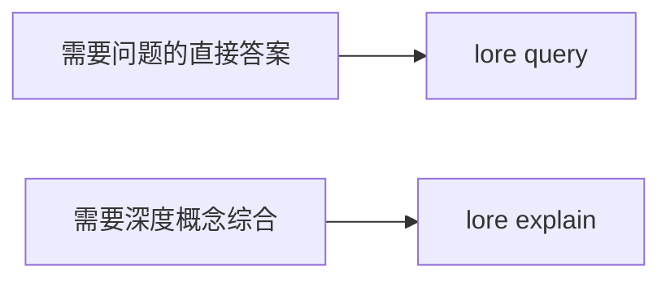

# 解释命令

```bash
lore explain "<concept>" [--json]
```

`lore explain` 通过结合主要匹配文章和附近的图邻居，提供深度概念演练。

## 查询与解释



| 命令 | 最佳用途 | 输出形状 |
|---|---|---|
| `lore query` | 直接问题回答 | 答案文本加源 slug |
| `lore explain` | 概念深度研究 | 长篇解释加相关源 slug |

## 解释如何选择上下文

1. 尝试概念的精确 slug 匹配
2. 如果精确 slug 缺失，回退到 FTS 匹配
3. 从图链接加载邻居文章
4. 从组合上下文综合详细解释

## 示例

```bash
# 人类可读的深度研究
lore explain "Compile Lock"

# 脚本友好
lore explain "MCP Server" --json
```

示例 JSON 响应：

```json
{
  "explanation": "...long-form explanation...",
  "sources": ["compile-lock", "watch-mode", "index-repair"]
}
```

## 集成用例

- 新工程师的入职深度研究
- 设计会议前的架构审查准备
- 需要广泛概念上下文而非一次性答案的代理工作流

## 故障排除

| 症状 | 可能原因 | 修复方法 |
|---|---|---|
| `No article found for <concept>` | 概念尚未索引 | 运行 `lore compile`，然后使用精确概念名称重试 |
| 解释太浅 | 邻居上下文稀疏 | 改进 Wiki 链接并重新运行编译/索引 |
| 源看起来不相关 | FTS 回退匹配了广泛术语 | 使用更具体的概念名称 |

## 相关文档

- [搜索与查询](./searching-and-querying.md)
- [编译你的 Wiki](./compiling-your-wiki.md)
- [故障排除](./troubleshooting.md)
- [CLI 参考](../reference/cli-reference.md)