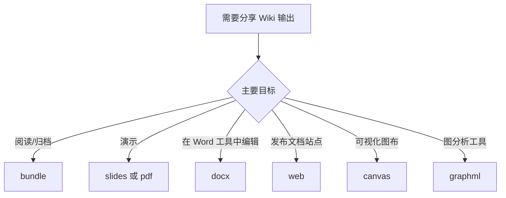

# 导出

```bash
lore export <format> [--out <dir>] [--json]
```

当你需要在 Lore 之外分享或分析 Wiki 时使用导出。

- 默认输出目录：`.lore/exports`
- 自定义输出目录：`--out <dir>`
- 机器可读结果：`--json` 返回 `format`、`outputPath` 和 `bytesWritten`

## 导出决策流程



## 格式

| 格式 | 输出 | 最佳用途 | 说明 |
|---|---|---|---|
| `bundle` | `bundle.md` | 归档、离线阅读、快速分享 | 连接索引 + 所有文章 Markdown |
| `slides` | `slides.md` | 使用 Marp 的演示文稿 | 将内容分割为部分和幻灯片分隔 |
| `pdf` | `wiki.pdf` | 利益相关者审查和快照 | 通过 Puppeteer 使用基本 HTML 渲染器 |
| `docx` | `wiki.docx` | 在 Word 类工具中编辑 | 转换 Markdown 标题/列表/段落 |
| `web` | `web/` 项目 | 发布可浏览的 Wiki 站点 | 脚手架 Astro + Starlight 项目 |
| `canvas` | `wiki.canvas` | 节点链接可视化工作流 | JSON Canvas 1.0，包含网格布局节点 |
| `graphml` | `wiki.graphml` | Gephi/yEd 和图分析 | 来自 Wiki 反向链接的有向图 |

## 常用用法

```bash
# 默认输出：.lore/exports
lore export bundle

# 自定义输出目录
lore export web --out ./artifacts/wiki-web

# 脚本友好响应
lore export graphml --json
```

示例 JSON 响应：

```json
{
	"format": "graphml",
	"outputPath": "/repo/.lore/exports/wiki.graphml",
	"bytesWritten": 84211
}
```

## 格式演练

### `bundle`

```bash
lore export bundle
```

创建一个 Markdown 文档，包含你的索引，后跟所有文章，用 `---` 分隔。

用例：

- 在编辑器中单文件审查
- 长篇归档快照
- 外部 Markdown 管道的输入

### `slides`

```bash
lore export slides --out ./presentation
```

生成兼容 Marp 的 Markdown，启用 frontmatter 和分页。

用例：

- 内部架构简报
- 知识转移会议
- 发布演示文稿

### `pdf`

```bash
lore export pdf
```

通过轻量级 HTML 模板转换 Markdown 包并使用 Puppeteer 渲染来构建 PDF。

用例：

- 可打印文档
- 静态交付物
- 合规快照

### `docx`

```bash
lore export docx
```

将 Wiki 文章转换为 DOCX 文件，包含映射的标题和项目符号列表。

用例：

- 在 Office 套件中协作编辑
- 正式审查工作流
- 编辑清理过程

### `web`

```bash
lore export web
cd .lore/exports/web
npm install
npm run dev
```

脚手架 Astro Starlight 站点并将你的 Wiki 页面复制到 `src/content/docs`。

用例：

- 内部文档托管
- 临时预览站点
- 团队入职门户

### `canvas`

```bash
lore export canvas
```

生成 JSON Canvas 输出，包含文章节点和反向链接边。

用例：

- 概念关系可视化地图
- 在画布工具中的规划会议
- 图导向的内容审计

### `graphml`

```bash
lore export graphml
```

从你的文章/链接表导出 GraphML 图，用于 Gephi 和 yEd 等工具。

用例：

- 中心性/社区分析
- 图调试
- 外部数据科学工作流

## 端到端示例

```bash
# 1) 刷新 Wiki 状态
lore ingest ./docs
lore compile

# 2) 生成多个交付物
lore export bundle --out ./dist/lore
lore export pdf --out ./dist/lore
lore export web --out ./dist/lore

# 3) 检查生成的产物
ls -la ./dist/lore
```

## 故障排除

| 症状 | 可能原因 | 修复方法 |
|---|---|---|
| 导出失败，缺少文章目录 | Wiki 尚未编译 | 先运行 `lore compile` |
| `pdf` 导出失败 | Puppeteer 浏览器依赖问题 | 重新安装依赖并重试 `lore export pdf` |
| `web` 导出创建了项目但站点启动失败 | 导出项目中未安装依赖 | 在导出的 `web` 文件夹中运行 `npm install` |
| 输出过大无法分享 | 完整 Wiki 很大 | 使用 `bundle` 获取纯文本或在导出前分割内容 |

## 相关文档

- [编译你的 Wiki](./compiling-your-wiki.md)
- [搜索与查询](./searching-and-querying.md)
- [CLI 参考](../reference/cli-reference.md)