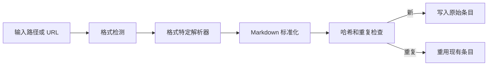

# 摄入内容

```bash
lore ingest <path|url>
```

```bash
lore ingest-sessions [framework|all]
```

## 支持的格式

| 格式 | 方法 |
|---|---|
| `.md`、`.txt` | 直接 |
| `.html` | rehype-parse |
| `.json`、`.jsonl` | JSON 解析器（自动标准化支持的聊天导出） |
| `.pdf`、`.docx`、`.pptx`、`.xlsx`、`.epub` | Replicate marker |
| 图像（`.png`、`.jpg`、`.jpeg`、`.webp`、`.gif`、`.bmp`） | Replicate vision |
| URL（网页） | Cloudflare BR `/markdown` 端点或 Jina r.jina.ai |
| URL（文档：`.pdf`、`.docx`、`.pptx`、`.xlsx`、`.epub`） | 临时下载 → Replicate Marker |
| URL（图像：`.png`、`.jpg`、`.jpeg`、`.webp`、`.gif`、`.bmp`） | 临时下载 → Replicate Vision |
| 视频 URL | yt-dlp 字幕 |

所有摄入的内容存储在 `.lore/raw/<sha256>/` 中，包含 `extracted.md` 和 `meta.json`。

## 框架会话摄入

使用 `lore ingest-sessions` 从本地框架存储中提取会话历史。

支持的框架值：

- `claude-code`
- `codex-cli`
- `copilot-cli`
- `copilot-chat`
- `cursor`
- `gemini-cli`
- `obsidian`
- `all`（默认）

示例：

```bash
# 摄入所有支持的框架会话存储
lore ingest-sessions all

# 仅摄入 Claude Code 会话
lore ingest-sessions claude-code

# 仅运行发现，不写入摄入
lore ingest-sessions all --dry-run --json

# 覆盖默认根路径并限制扫描大小
lore ingest-sessions copilot-chat --root ~/Library/Application\ Support/Code/User/workspaceStorage --max-files 200
```

标志：

- `--root <path...>`：可选的根路径，用于替代默认路径
- `--max-files <n>`：每个框架的最大发现文件数（默认 `500`）
- `--dry-run`：仅发现，不摄入
- `--json`：机器可读的摘要，包含 `runId`/`logPath`

## 摄入流程



## 原始条目结构

每个原始条目存储在：

```text
.lore/raw/<sha256>/
	extracted.md
	meta.json
	original.<ext>（或 URL 的 original.txt）
```

示例 `meta.json`：

```json
{
	"sha256": "<sha256>",
	"format": "json",
	"title": "Conversation Transcript",
	"sourcePath": "/abs/path/to/file.json",
	"date": "2026-04-09T00:00:00.000Z",
	"tags": ["docs", "frontend", "decision"]
}
```

## 基于文件夹的主题标签

对于本地文件摄入，Lore 从目录名称推断一组小的主题标签，并将其写入 `meta.json.tags`。

- 示例映射类别包括 `frontend`、`backend`、`docs`、`testing`、`tooling`、`infra`、`data`、`mobile` 和 `design`。
- URL 摄入不推断文件夹标签，保持 `tags: []`。
- 标签故意有限且去重，以保持元数据简洁。

Lore 还在摄入期间应用轻量级内容启发式，并在检测到匹配短语时附加语义标签，如 `decision`、`preference`、`problem`、`milestone` 和 `emotional`。

## 重复感知摄入

Lore 从原始输入计算 SHA-256 摘要，并在摘要已存在时重用现有原始条目。

- 重复命中行为：
	- 跳过解析/提取
	- 重用现有元数据
	- 刷新清单 mtime
- JSON 输出在重复命中时包含 `duplicate: true`。

示例：

```bash
lore ingest ./docs/architecture.md --json
```

可能的输出字段：

```json
{
	"sha256": "...",
	"format": "md",
	"title": "Architecture",
	"duplicate": true
}
```

## 对话导出摄入工作原理（`.json` / `.jsonl`）

1. Lore 首先尝试检测已知的对话模式。
2. 当检测到支持的模式时，Lore 将内容重写为转录 Markdown：
	- 用户回合以 `>` 为前缀
	- 助手回合保留为响应块
3. 当前自动检测目标是常见的导出，如 role/content 数组、ChatGPT 映射导出和 Codex/Claude 风格的 JSONL 日志。
4. 如果未检测到已知模式，Lore 回退到通用 JSON 到 Markdown 转换。

支持的对话模式家族包括：

- role/content 数组（`[{"role":"user"...}]`）
- ChatGPT 映射导出
- Claude/Codex JSONL 会话日志
- Slack 风格的消息数组

## PDF 摄入工作原理

1. Lore 检测文档扩展名，如 `.pdf` 或 `.docx`。
2. 文件发送到 Replicate Marker（`cuuupid/marker`）进行 Markdown 提取。
3. 标准化的 Markdown 写入 `.lore/raw/<sha256>/extracted.md`。
4. 元数据和源跟踪写入 `.lore/raw/<sha256>/meta.json`。

## 网页文档和图像 URL 摄入工作原理

Lore 检测 URL 路径中的文件扩展名，以区分网页、文档和图像。

对于**文档 URL**（以 `.pdf`、`.docx`、`.pptx`、`.xlsx`、`.epub` 结尾）：

1. Lore 将文件下载到临时目录。
2. 通过 Replicate Marker 发送——与本地文档使用相同的解析器。
3. 提取完成后清理临时文件。
4. 将结果存储在相同的原始管道中（`extracted.md` + `meta.json`）。

对于**图像 URL**（以 `.png`、`.jpg`、`.jpeg`、`.webp`、`.gif`、`.bmp` 结尾）：

1. Lore 将图像下载到临时目录。
2. 通过 Replicate Vision 发送——与本地图像使用相同的解析器。
3. 提取完成后清理临时文件。
4. 将结果存储在相同的原始管道中。

对于**所有其他 URL**（网页、HTML、API 等）：

1. 当配置了 `LORE_CF_ACCOUNT_ID` 和 `LORE_CF_TOKEN` 时，Lore 调用 Cloudflare 浏览器运行 `/markdown` 端点——这直接提供 JavaScript 渲染的 Markdown。默认情况下，Lore 在捕获页面前等待 `networkidle2`（≤2 个打开的连接）。使用 `--cf-wait-until networkidle0` 覆盖打开持久连接的页面。
2. Cloudflare 失败或凭证缺失时，Lore 回退到 Jina `r.jina.ai`。

> **要求**：文档/图像 URL 摄入需要与本地文档/图像摄入相同的凭证——`TELEPAT_REPLICATE_TOKEN`。网页摄入需要 Cloudflare 的 `LORE_CF_ACCOUNT_ID` + `LORE_CF_TOKEN`（Jina 是无需凭证的回退）。

## YouTube/视频摄入工作原理

1. Lore 检测已知的视频主机（例如 YouTube、Vimeo、Twitch）。
2. 尝试使用 `yt-dlp` 提取字幕。
3. 字幕从 VTT 清理为纯转录文本。
4. 转录输出存储在相同的原始管道中（`extracted.md` + `meta.json`）。
5. 如果 `yt-dlp` 不可用或字幕缺失，Lore 回退到 URL 获取摄入。

提取器来源：

- 视频摄入的 `meta.json` 包含 `extractor` 字段。
- `extractor: yt-dlp` 表示字幕提取成功。
- 回退值包括 `url-fallback-no-ytdlp`、`url-fallback-no-subs` 和 `url-fallback-empty-transcript`。

## 相关参考

- [支持的格式](../reference/supported-formats.md)
- [LLM 模型](../reference/llm-models.md)
- [凭证与密钥](./credentials-and-secrets.md)

## 故障排除

- JSON 未标准化为转录：
	- 确保文件是有效的 JSON/JSONL
	- 检查记录是否包含 user/assistant 风格的回合
	- 如果模式未知，Lore 会故意回退到通用 JSON Markdown
- 意外标签：
	- 文件夹标签是路径派生的且有限的
	- 启发式标签是短语驱动的且保守的
- URL 摄入路径：
	- 以文档或图像扩展名（`.pdf`、`.docx`、`.png` 等）结尾的 URL 触发临时下载和本地解析器路由——与本地文件摄入相同
	- 对于网页 URL，使用 `LORE_CF_ACCOUNT_ID` + `LORE_CF_TOKEN`，Lore 直接调用 Cloudflare 浏览器运行 `/markdown` 端点
	- CF 失败或凭证缺失时，Lore 自动回退到 Jina 获取