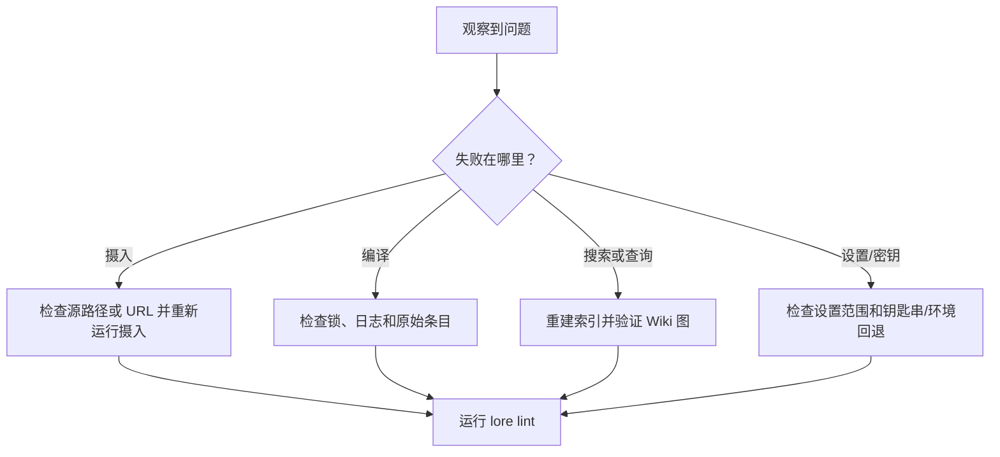

# 故障排除

当 Lore 命令在语法上成功但输出缺失、过期或质量低下时，使用此页面。

## 快速分类流程



## 常见问题

| 症状 | 可能原因 | 解决方法 |
|---|---|---|
| `Another compile is already running` | `.lore/compile.lock` 被实时进程持有 | 等待并重新运行编译。如果进程已死亡，重新运行编译，Lore 会回收过期锁 |
| `Compiled 0 articles` 意外 | 没有提取内容更改，基于哈希的增量编译跳过了工作 | 使用 `lore compile --force` 重新处理所有有效原始条目 |
| 搜索结果过期或为空 | 索引漂移或缺失清单条目 | 运行 `lore index --repair`，然后重试搜索/查询 |
| 查询答案质量低 | 检索上下文薄弱或模糊 | 运行 `lore lint`，检查间隙/孤立，改进链接，然后重新编译 |
| 查询未创建 QA 文件 | 使用了 `--no-file-back` | 省略 `--no-file-back` 或检查 `.lore/wiki/derived/qa/` |
| Angela 安装后失败 | Git 历史太浅或最后两个提交之间没有差异 | 确保至少两个提交并手动重新运行 `lore angela run` |
| `pdf` 导出失败 | Puppeteer/浏览器依赖问题 | 重新安装依赖并重试 `lore export pdf` |
| 文章缺少来源标记 | 在引入来源之前编译的文章 | 运行 `lore compile --concepts-only` 回填 |
| 源持续产生零概念 | 内容太抽象或太短，无法进行 LLM 概念提取 | 审查原始内容质量；使用更丰富的源材料重新摄入 |
| 软删除的文章重新出现 | 文章被后续编译从新源重新创建 | 预期行为；如果需要使用 `--force` 重新编译 |

## 恢复手册

### 编译似乎卡住

```bash
# 1) 检查活动的 lore 进程
ps aux | grep lore

# 2) 重试编译
lore compile

# 3) 如果仍然阻塞，运行完整维护过程
lore index --repair
lore lint
```

### 搜索或查询质量下降

```bash
# 1) 刷新索引和清单一致性
lore index --repair

# 2) 检查图健康状态
lore lint --json

# 3) 再次提出一个专注的问题
lore query "How does compile locking work?" --normalize-question
```

### 导出产物缺少预期内容

```bash
# 1) 确保存在新鲜的 Wiki 材料
lore compile --force

# 2) 以目标格式再次导出
lore export bundle --out ./dist

# 3) 快速检查输出
wc -l ./dist/bundle.md
```

## 基于日志的调试

`lore ingest`、`lore compile` 和 `lore query` 在 `.lore/logs/` 中生成 JSONL 日志。

当命令失败且终端细节不足时使用这些：

```bash
# 最新的日志优先
ls -lt .lore/logs | head

# 检查一次运行日志
cat .lore/logs/<run-id>.jsonl
```

## 升级清单

在提交问题或寻求帮助之前，收集：

1. 使用的命令和标志
2. 是否捕获了 `--json` 输出
3. 相关的 `.lore/logs/<run-id>.jsonl` 片段
4. `lore lint --json` 的输出
5. `lore index --repair` 是否改变了行为

## 相关文档

- [编译你的 Wiki](./compiling-your-wiki.md)
- [搜索与查询](./searching-and-querying.md)
- [导出](./exporting.md)
- [CLI 参考](../reference/cli-reference.md)