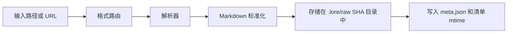

# 支持的格式

此页面是 Lore 的摄入/导出兼容性参考。

## 摄入格式

| 格式 | 解析器 | 要求 | 说明 |
|---|---|---|---|
| `.md` | 直接 | 无 | 通过标准化保留 Markdown |
| `.txt` | 直接 | 无 | 视为纯文本 |
| `.html` / `.htm` | HTML 解析器 | 无 | 标准化前转换为 Markdown |
| `.json` / `.jsonl` | JSON 解析器 | 无 | 首先尝试对话转录检测 |
| `.pdf` | Replicate Marker | Replicate 令牌 | 在 Replicate 上使用 Marker 模型 |
| `.docx` / `.pptx` / `.xlsx` / `.epub` | Replicate Marker | Replicate 令牌 | 通过 Marker 解析为文档格式 |
| 图像（`.png`、`.jpg`、`.jpeg`、`.webp`、`.gif`、`.bmp`、`.tiff`） | Replicate Vision | Replicate 令牌 | OCR + 描述性提取 |
| 网页 URL | Cloudflare BR `/markdown` 或 Jina | 可选 CF 凭证 | 凭证存在时使用 Cloudflare Markdown 端点；Jina 回退 |
| 文档 URL（`.pdf`、`.docx`、`.pptx`、`.xlsx`、`.epub`） | 临时下载 → Replicate Marker | Replicate 令牌 | 下载到临时目录，然后像本地文档一样处理 |
| 图像 URL（`.png`、`.jpg`、`.jpeg`、`.webp`、`.gif`、`.bmp`） | 临时下载 → Replicate Vision | Replicate 令牌 | 下载到临时目录，然后像本地图像一样处理 |
| 视频 URL | `yt-dlp` 字幕管道 | 推荐 `yt-dlp` | 字幕不可用时回退到 URL 解析器 |

## 摄入管道概述



## 会话框架源

Lore 可以使用以下命令直接摄入本地会话历史：

```bash
lore ingest-sessions [framework|all]
```

| 框架键 | 默认源位置（取决于操作系统） | 典型文件类型 |
|---|---|---|
| `claude-code` | `~/.claude/projects/` | `.jsonl` |
| `codex-cli` | `~/.codex/sessions/`、`~/.codex/projects/` | `.jsonl` |
| `copilot-cli` | `~/.copilot/session-state/`（或 `COPILOT_HOME`） | `events.jsonl` |
| `copilot-chat` | VS Code 工作区存储 `*/chatSessions/` | `.jsonl`、`.json` |
| `cursor` | Cursor 工作区存储 | `.jsonl`、`.json` |
| `gemini-cli` | `~/.gemini/`、`~/.config/gemini/` | `.jsonl`、`.json`、`.md` |
| `obsidian` | `~/Documents/Obsidian Vault/`（或自定义根目录） | `.md` |

说明：

- 会话导入通过相同的原始摄入管道运行，生成 `.lore/raw/<sha>/` 条目。
- `meta.json` 现在包含框架摄入源的 `session` 元数据。
- `--dry-run` 允许你在写入摄入输出前审计发现。

## 对话导出支持（`.json` / `.jsonl`）

Lore 在通用 JSON 渲染前尝试模式检测。

识别的模式家族：

- role/content 消息数组（`user`/`assistant`，包括 `human`/`ai` 角色变体）
- ChatGPT 映射导出（`mapping` 图）
- Claude 风格和 Codex 风格的 JSONL 会话事件
- Slack 风格的消息数组

对话输出标准化为转录 Markdown，包含带引号的用户行和助手响应块。

### 模式矩阵

| 输入形状 | 检测结果 | 输出 |
|---|---|---|
| 带 role-content 消息的数组/对象 | 对话转录 | `# Conversation Transcript` Markdown |
| ChatGPT 映射对象 | 对话转录 | 有序的 user/assistant 回合 |
| JSONL 会话事件 | 对话转录 | 来自事件负载的有序回合 |
| Slack 消息数组 | 对话转录 | 启发式交替角色映射 |
| 未识别的模式 | 通用 JSON 渲染 | 标题/值 Markdown 转换 |

如果文件不匹配已知的对话模式，Lore 会回退到通用 JSON 到 Markdown 转换。

## URL 和视频行为

### URL 内容

Lore 根据 URL 路径中的文件扩展名路由 URL 摄入：

- **文档扩展名**（`.pdf`、`.docx`、`.pptx`、`.xlsx`、`.epub`）：下载到临时文件，然后通过 Replicate Marker 处理——与本地文档摄入相同。需要 `TELEPAT_REPLICATE_TOKEN`。
- **图像扩展名**（`.png`、`.jpg`、`.jpeg`、`.webp`、`.gif`、`.bmp`）：下载到临时文件，然后通过 Replicate Vision 处理——与本地图像摄入相同。需要 `TELEPAT_REPLICATE_TOKEN`。
- **所有其他 URL**（网页、HTML 等）：
  - 当同时设置了 `LORE_CF_ACCOUNT_ID` 和 `LORE_CF_TOKEN` 时，Lore 调用 Cloudflare 浏览器运行 `/markdown` 端点，直接返回 Markdown 而无需本地 HTML 转换。
  - Cloudflare 失败或非字符串响应时，Lore 记录回退并使用 Jina。
  - 没有 Cloudflare 凭证时，Lore 直接通过 Jina 获取。

### 视频 URL

- Lore 检查 `yt-dlp`
- 如果字幕可用，Lore 摄入清理后的转录文本
- 如果 `yt-dlp` 缺失或字幕不可用/为空，Lore 回退到 URL 解析

提取器元数据存储在视频摄入的 `meta.json` 中。

## 原始元数据说明

- 所有摄入创建 `.lore/raw/<sha256>/meta.json`
- 本地文件摄入可以推断文件夹派生的标签
- 提取的文本可以附加启发式内存标签（`decision`、`preference`、`problem`、`milestone`、`emotional`）
- 重复摄入重用现有原始条目

## 导出格式

Lore 支持这些导出目标：

- `bundle`
- `slides`
- `pdf`
- `docx`
- `web`
- `canvas`
- `graphml`

参见[导出](../guides/exporting.md)了解详细用例和输出示例。

## 实际示例

```bash
# 摄入混合文件夹
lore ingest ./docs/architecture.md
lore ingest ./notes/session.jsonl
lore ingest ./assets/diagram.png

# 摄入 URL 和视频 URL
lore ingest https://example.com/post
lore ingest https://www.youtube.com/watch?v=<id>
```