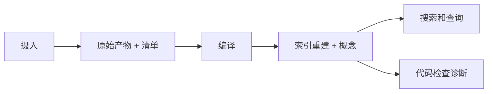
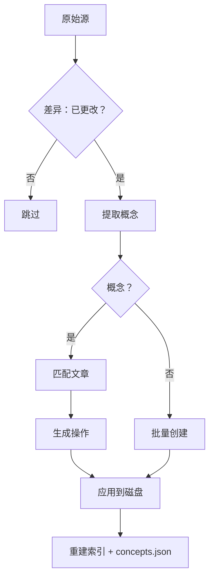

# 架构

Lore 将 Markdown 优先的知识存储与用于摄入、编译、检索和质量执行的操作管道相结合。

## 4 层 Wiki

1. **索引** (`wiki/index.md`) -- 始终首先被查阅
2. **文章** (`wiki/articles/*.md`) -- 包含反向链接和来源的概念文章
3. **派生** (`wiki/derived/`) -- 问答答案、幻灯片、图表
4. **资产** (`wiki/assets/`) -- 本地图像

支持状态存储在 `.lore/` 中：

- `raw/` 按内容哈希键控的标准化摄入产物
- `manifest.json` 源到原始跟踪、编译时间戳、提取的哈希
- `wiki/concepts.json` 编译后生成的标准化概念元数据
- `wiki/concepts/` 每个概念的详细页面（可选）
- `wiki/deprecated/` 为审计保留的已软删除文章
- `db.sqlite` FTS/反向链接数据库
- `compile.lock` 活动编译互斥文件

## 仓库布局快照

| 路径 | 用途 |
|---|---|
| `.lore/raw/` | 按哈希键控的源派生提取产物 |
| `.lore/wiki/articles/` | 包含来源的编译后概念页面 |
| `.lore/wiki/deprecated/` | 已软删除的文章（审计跟踪） |
| `.lore/wiki/index.md` | 规范主题索引 |
| `.lore/wiki/concepts.json` | 包含别名/标签/置信度的概念索引 |
| `.lore/wiki/derived/qa/` | 归档的查询答案 |
| `.lore/db.sqlite` | FTS 和链接图表 |
| `.lore/logs/` | JSONL 命令运行日志 |

## 4 阶段管道

1. **摄入** -- `raw/` 填充 `extracted.md` + `meta.json`
2. **编译** -- 6 步管道：差异 → 提取概念 → 匹配 → 生成操作 → 应用 → 重建索引
3. **查询** -- 通过 BFS/DFS 遍历进行问答，归档到 `derived/qa/`
4. **代码检查** -- 揭示孤立、间隙、模糊声明和行感知诊断

在操作上，这些阶段是幂等的，可以增量重新运行。

编译默认是哈希增量的：未更改的提取内容基于 `manifest.json` `extractedHash` 字段跳过。

### 管道图



### 编译子管道



## 来源模型

每篇文章跟踪哪些源贡献了哪些行。两种机制：

### 内联来源

行携带 `<!-- sources:HASH(CONFIDENCE) -->` 注释：

```markdown
The auth service uses JWT. <!-- sources:abc123(extracted) def456(inferred) -->
```

当 LLM 读取文章进行匹配时，来源注释被剥离。LLM 看到干净的编号行。

### 累积引用

每篇文章以 `## References` 部分结束，列出所有曾经合并的源哈希：

```markdown
## References
- abc123 (extracted)
- def456 (inferred)
```

此部分由系统管理，在 LLM 上下文中被隐藏。

### 相关部分

`## Related` 从文章主体中找到的 `[[wiki-links]]` 自动生成。

## 操作模型

LLM 输出行级操作（JSON）。每个操作携带 `sources` 数组用于来源跟踪：

| 操作 | 效果 |
|---|---|
| `replace` | 替换一行 |
| `insert-after` | 在目标行后插入 |
| `delete-range` | 删除行（验证：start ≤ end） |
| `replace-range` | 替换一段行 |
| `split` | 将文章拆分为两部分 |
| `append-source` | 向现有行添加源（无内容更改） |
| `soft-delete` | 将文章移动到已弃用 |

操作按源顺序应用。行引用使用 `¶`（段落符号）前缀以区别于 YAML 行号。

## 编译可靠性控制

| 控制 | 目的 |
|---|---|
| PID 锁文件（`compile.lock`） | 防止重叠编译运行 |
| 基于哈希的跳过 | 避免重新编译未更改的提取内容 |
| 每源重试（1 次尝试） | 从格式错误的 LLM 输出中恢复 |
| 零概念跳过 | 没有可提取概念的源进入批量创建 |
| `start > end` 验证 | 范围操作拒绝无效跨度 |
| 编译后索引重建 | 保持 FTS/图状态与文章集对齐 |

## 摄入和元数据流

摄入写入 `.lore/raw/<sha>/extracted.md` 和 `.lore/raw/<sha>/meta.json`。

元数据可以包括：

- 规范源标识
- 文件夹派生的主题标签
- 启发式内存类型标签
- 时间戳和来源字段

重复内容通过哈希检测并重用现有原始条目。

元数据标签可以来自路径提示和内存模式启发式，以改善下游分类和发现。

## 查询流和标准化

`query` 使用来自 FTS + 图上下文的混合检索。

问题文本标准化是可选的，由以下控制：

- CLI 标志：`--normalize-question`、`--no-normalize-question`
- 环境默认值：`LORE_QUERY_NORMALIZE`

标准化故意保守，以避免修改技术标记。

检索序列：

1. 加载索引上下文
2. 运行 FTS 候选选择
3. 通过链接图扩展一跳邻居
4. 通过 LLM 综合答案

## 图和搜索存储

SQLite 结构：

- `fts`：全文索引（`slug`、`title`、`body`），支持排名/摘要
- `links`：概念边（`from_slug`、`to_slug`）

`lore path` 通过无向邻接的 BFS 计算最短概念路径，该邻接来自 `links`。

## 索引完整性和防护栏

索引重建可以在标准或修复模式下运行：

- 标准：从清单/原始状态重新生成数据库产物
- 修复：从现有原始文件夹恢复缺失的清单条目

反向链接索引过滤低信号 wiki 链接目标（例如仅停用词链接）以减少图噪声。

来源注释在 FTS 索引前从文章主体中剥离，以免污染搜索结果。

防护栏好处：

- 概念图中更少的噪声边
- 更干净的代码检查间隙/孤立信号
- 更稳定的路径和邻居探索

## MCP 维护表面

MCP 服务器为自动化循环暴露维护和诊断工具，包括：

- 摄入前重复检查
- 原始标签分布摘要
- 孤立/间隙/歧义代码检查摘要
- 索引重建和修复触发器

## SQLite 模式

- `fts` -- FTS5 虚拟表（slug、title、body），支持 Porter 词干提取
- `links` -- 反向链接图（from_slug、to_slug）

## 相关文档

- [摄入管道](./ingest-pipeline.md)
- [LLM 管道](./llm-pipeline.md)
- [运行日志](./logging.md)
- [编译你的 Wiki](../guides/compiling-your-wiki.md)