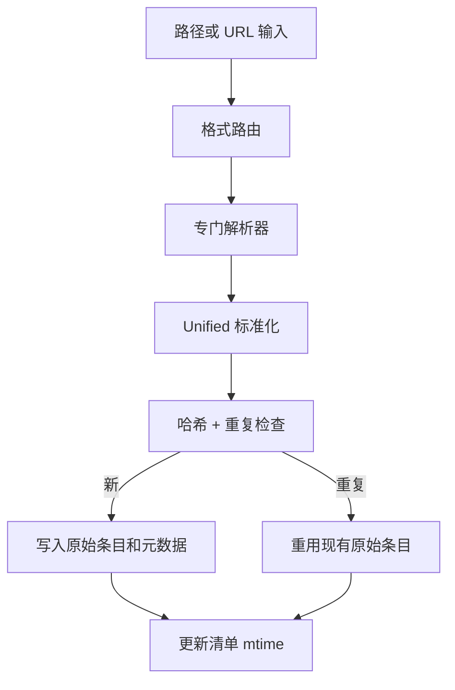

# 摄入管道

两个阶段：**格式提取** 然后 **Unified.js 标准化**。

每次成功的摄入在 `.lore/raw/<sha256>/` 中创建一个确定性的原始条目。

## 阶段 1：格式提取

根据文件类型或 URL 模式路由到正确的解析器。

### 路由矩阵

| 输入类型 | 解析器路径 | 说明 |
|---|---|---|
| markdown/text | 直接文本提取 | 由 unified 管道标准化 |
| html | HTML 解析器 | 转换为 markdown |
| json/jsonl | 对话检测 + JSON 渲染回退 | 转录优先策略 |
| pdf/docx/pptx/xlsx/epub | Replicate Marker | 需要 Replicate 令牌 |
| 图像格式 | Replicate Vision | OCR/说明提示提取 |
| 网页 URL | 如果配置了 Cloudflare BR `/markdown` 端点，否则 Jina | 直接返回 markdown；Cloudflare 失败回退到 Jina |
| 文档 URL（`.pdf`、`.docx` 等） | 临时下载 → Replicate Marker | 与本地文档文件相同的路径 |
| 图像 URL（`.png`、`.jpg` 等） | 临时下载 → Replicate Vision | 与本地图像文件相同的路径 |
| 视频 URL | `yt-dlp` 字幕工作流 | 不可用时回退到 URL 解析 |

### 解析器选择

- Markdown 和类似文本的文件通过直接 markdown 标准化路由。
- Office/PDF/媒体格式通过专门的提取器路由。
- `.json` / `.jsonl` 内容首先进行模式检查，用于对话导出。
- 带有文档或图像扩展名的 URL 下载到临时文件，并通过相同的本地提取器（Marker 或 Vision）路由。
- 所有其他 URL 根据源和配置通过获取/浏览器提取路由。

### 视频 URL 回退行为

1. 检查 `yt-dlp` 可用性
2. 尝试字幕下载和清理
3. 如果字幕缺失/为空，使用 URL 解析回退

提取器来源写入原始元数据（`meta.json`）。

### 对话模式检测

对于 JSON 输入，Lore 在通用渲染前尝试结构化对话提取。支持的家族包括：

- role/content 数组
- ChatGPT 映射树
- Codex/Claude 风格 JSONL 会话
- Slack 风格的消息数组

如果检测失败，Lore 回退到通用 JSON Markdown 输出。

### 对话标准化结果

识别的对话模式作为转录 Markdown 在标准标题（`# Conversation Transcript`）下发出，用户回合带引号，助手回合保留为散文。

## 阶段 2：Unified.js 标准化

1. 解析为 mdast AST（remark-parse）
2. 提取 YAML frontmatter，解析 `[[wiki-links]]`
3. 标准化标题层次结构，去重空白
4. 序列化为 `extracted.md`

标准化目标：为确定性哈希和更干净的编译输入生成稳定的 markdown。

## 原始条目布局

每个原始目录包含：

- `source` 副本（可用时）
- `extracted.md` 标准化 markdown
- `meta.json` 摄入元数据

典型的 `meta.json` 包括：

- 内容哈希和格式
- 源路径或 URL 来源
- 提取日期/时间
- 推断的主题和内存标签
- 可选的提取器标识符（视频摄入）

`meta.json` 包含来自以下来源的计时/来源字段和标签：

- 源 frontmatter 标签
- 文件夹路径推断的主题标签
- 启发式内存信号（`decision`、`preference`、`problem`、`milestone`、`emotional`）

## 重复检测

摄入计算源哈希，并在精确内容已摄入时短路。

- 不创建重复的原始目录
- 重用现有原始条目
- 摄入结果包含 `duplicate=true`

这保持 `raw/` 稳定并防止下游的重复文章流失。

## 摄入流程图

## 操作防护栏

| 防护栏 | 好处 |
|---|---|
| 确定性哈希标识 | 防止重复和稳定的清单跟踪 |
| 解析器回退链 | 在部分配置的环境中弹性摄入 |
| 元数据丰富 | 更好的下游索引和维护工作流 |

## 故障排除信号

| 症状 | 可能原因 | 修复方法 |
|---|---|---|
| JSON 文件未视为转录 | 模式未识别 | 检查结构或依赖通用 JSON markdown 回退 |
| 视频摄入无转录 | `yt-dlp` 不可用或无字幕 | 安装 `yt-dlp` 或接受 URL 回退输出 |
| URL 提取质量差 | 源渲染复杂性 | 配置 Cloudflare BR 或摄入本地导出副本 |

## 与索引的交互

`compile` 和显式 `index` 操作从 `raw/` 消费 `meta.json` + `extracted.md`。

如果旧清单引用缺失的原始目录，索引修复模式（`lore index --repair`）通过扫描现有原始文件夹重建缺失的清单条目。

## 相关文档

- [支持的格式](../reference/supported-formats.md)
- [编译你的 Wiki](../guides/compiling-your-wiki.md)
- [故障排除](../guides/troubleshooting.md)